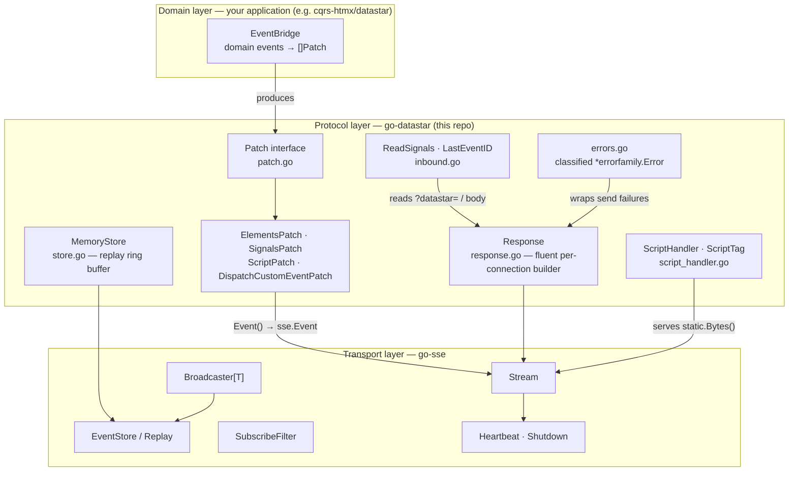

# Architecture

go-datastar is the middle layer of a three-layer stack. Each layer is a
separate repository with its own release cadence; this document walks the
layers top-down with the key types and where they live.



## Transport layer — go-sse

| Type                      | Role                                                                                               |
| ------------------------- | -------------------------------------------------------------------------------------------------- |
| `sse.Stream`              | One live SSE connection; owns writes, flushing, and close semantics                                |
| `sse.Broadcaster[T]`      | Fan-out of `T` (in practice `sse.Event`) to N subscribers with per-subscriber buffers and `OnDrop` |
| `sse.EventStore` + replay | Persisted event log so reconnecting clients can resume from `Last-Event-ID`                        |
| `sse.SubscribeFilter`     | Per-subscriber event filtering without custom fan-out code                                         |

go-datastar never opens sockets; everything it produces is an `sse.Event`
handed to a Stream, Broadcaster, or EventStore.

## Protocol layer — go-datastar

The keystone is the `Patch` interface (patch.go):

```go
type Patch interface { Event() sse.Event }
```

Every protocol message is a value that renders to an `sse.Event`, so patches
can be built without a connection, stored, filtered, replayed, and broadcast.

| Area                     | Key types / functions                                                            | File                                                      |
| ------------------------ | -------------------------------------------------------------------------------- | --------------------------------------------------------- |
| Patch values             | `ElementsPatch`, `SignalsPatch`, `ScriptPatch`, `DispatchCustomEventPatch`       | elements.go, signals.go, script.go, script_convenience.go |
| Constructors             | `NewElementsPatch`, `NewSignalsPatch`, `NewScriptPatch`, `NewRedirectPatch`, …   | same files                                                |
| Templ / GoStar rendering | `ElementsFromTempl`, `ElementsFromGostar`                                        | elements.go                                               |
| Per-connection builder   | `Response` (+ `ErrorResponse`, `NotificationResponse`, `ErrorResponseFromError`) | response.go                                               |
| Inbound                  | `ReadSignals`, `LastEventID`                                                     | inbound.go                                                |
| JS serving               | `ScriptHandler`, `ScriptHandlerWith`, `ScriptTag`, `Version`                     | script_handler.go                                         |
| Replay store             | `MemoryStore` (implements `sse.EventStore`)                                      | store.go                                                  |
| Wire helpers             | dataline key constants, retry/mode defaults                                      | constants.go                                              |
| Errors                   | classified codes + sentinels                                                     | errors.go                                                 |

Behavioral guarantees that span these files (mode defaults, dataline key
shapes, splitting rules) are pinned by `wire_golden_test.go` and documented
in [wire-format.md](wire-format.md).

## Domain layer — your application

The library is deliberately domain-free (see "What This Library Is NOT" in
the README). Domain adapters translate business events into `[]Patch` values
and route them through the transport primitives — the reference pattern is
[example/domain-adapter/](../example/domain-adapter/), a miniature EventBridge
E2E-tested with datastartest.

## Module boundaries within this repo

Three Go modules (rationale in [ADR 002](adr/002-multi-module-split.md)):
root (protocol), `static/` (embedded JS bundle, zero deps), `datastartest/`
(consumer E2E helpers). Root never requires datastartest — enforced by
`module_boundary_test.go` with semantic modfile parsing.
