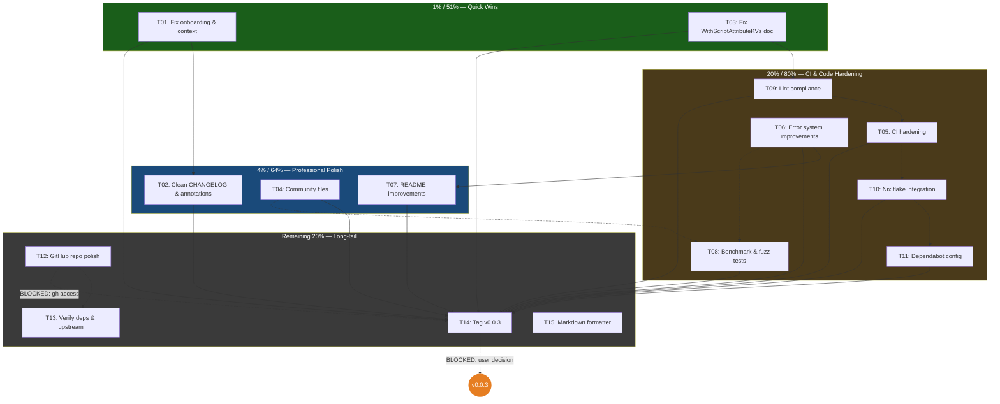

# Pareto Execution Plan: go-datastar Hardening

**Date:** 2026-08-08 03:16
**Scope:** All open work items from TODO_LIST.md (32 items), status report 2026-08-08_03-05 section f) (50 items), and ROADMAP.md ideas ready to graduate.
**Goal:** Ship a v0.0.3 release that is professionally maintained, trustworthy, and CI-hardened.

---

## Context

go-datastar is a public Go library at v0.0.2 on the Go module proxy. It works — tests pass at 98.7% coverage, lint is clean, erraudit has only accepted-by-design warnings. But it has trust gaps: broken onboarding docs, stale AI context, a doc/code lie in the API, no community files, and CI that doesn't run erraudit or govulncheck. This plan closes those gaps.

### Verschlimmbesserung guards

These decisions prevent dis-improvement:

| Risk                                                                 | Guard                                                                                                          |
| -------------------------------------------------------------------- | -------------------------------------------------------------------------------------------------------------- |
| WithScriptAttributeKVs: changing code to error = API breaking change | **Fix the doc, not the code.** The function signature returns no error; adding one breaks every caller.        |
| Splitting response.go (195 lines, 18 methods)                        | **Leave as ROADMAP.** Refactoring a working file for aesthetics risks import breakage.                         |
| nestif refactor of ReadSignals                                       | **Extract helper functions with identical behavior.** No logic changes, just structure. Test before and after. |
| erraudit exits non-zero on accepted warnings                         | **Add `//nolint` comments FIRST, then add erraudit to CI.** Reverse order breaks CI.                           |
| govulncheck may find CVEs in deps                                    | **Report findings, don't auto-fix.** A CVE in a transitive dep is a decision, not a drive-by fix.              |
| Tag v0.0.3 before all planned fixes land                             | **Tag LAST, after all changes are stable and tested.**                                                         |

---

## Step 1: Pareto Breakdown

### The 1% that delivers 51% of the result

Three items. ~22 minutes total. These fix the three most actively embarrassing things in the project.

| #    | Item                                         | Why it's 1%                                                                           | Impact   | Effort |
| ---- | -------------------------------------------- | ------------------------------------------------------------------------------------- | -------- | ------ |
| P1-1 | Fix CONTRIBUTING.md                          | Broken for 3 sessions. Every new contributor fails immediately.                       | Critical | 5min   |
| P1-2 | Update AGENTS.md (file layout + HEAD parity) | Every AI session reads stale context. Missing 2 test files + HEAD compliance.         | Critical | 10min  |
| P1-3 | Fix WithScriptAttributeKVs doc               | Active API documentation lie. Doc says "errors on odd args", code silently truncates. | Critical | 5min   |

**If nothing else is done, these three alone transform the project from "has known-broken things" to "honest."**

### The 4% that delivers 64% of the result

Add 6 items (~55 minutes) to the 1% tier. Together these take the project from "honest" to "professionally maintained."

| #    | Item                                         | Why it's in the 4%                                                      | Impact | Effort |
| ---- | -------------------------------------------- | ----------------------------------------------------------------------- | ------ | ------ |
| P4-1 | Clean CHANGELOG [Unreleased]                 | Remove internal noise. Consumer trust in release notes.                 | High   | 5min   |
| P4-2 | Fix vague annotations (add commit hashes)    | 5 annotations say "done in subsequent sessions" — unverifiable.         | High   | 10min  |
| P4-3 | Create SECURITY.md + CODE_OF_CONDUCT.md      | Community readiness signals. GitHub looks for these.                    | High   | 10min  |
| P4-4 | Add error codes table to README              | 9 codes documented in AGENTS.md/errors.go but invisible in README.      | High   | 10min  |
| P4-5 | Update doc.go package comment                | Package doc doesn't mention classified errors. pkg.go.dev renders this. | High   | 10min  |
| P4-6 | Pin golangci-lint + upgrade Actions versions | CI reproducibility. `@latest` is non-deterministic.                     | High   | 10min  |

### The 20% that delivers 80% of the result

Add ~10 items to reach full CI hardening, error system maturity, and test coverage.

| #      | Item                                                            | Category  | Impact | Effort |
| ------ | --------------------------------------------------------------- | --------- | ------ | ------ |
| P20-1  | Add erraudit to CI                                              | CI        | High   | 30min  |
| P20-2  | Add govulncheck to CI                                           | CI        | High   | 30min  |
| P20-3  | Add nix checks (lint, erraudit, govulncheck)                    | CI        | Medium | 60min  |
| P20-4  | Fix DispatchCustomEventPatch silent swallow                     | Code      | Medium | 30min  |
| P20-5  | Error system improvements (input_preview, HTTPStatus, WrapOnce) | Code      | Medium | 90min  |
| P20-6  | Add benchmark tests                                             | Testing   | Medium | 60min  |
| P20-7  | Add fuzz test for MarshalSignals                                | Testing   | Medium | 30min  |
| P20-8  | Create issue templates + PR template                            | Community | Medium | 30min  |
| P20-9  | Add Dependabot config                                           | CI        | Medium | 20min  |
| P20-10 | Add `//nolint` comments on accepted warnings                    | Lint      | Medium | 20min  |

### The remaining 20% (to reach 100%)

Long-tail polish: GitHub repo settings, coverage badge, examples, markdown formatting, upstream tracking, architecture diagram, release tooling, migration guide.

---

## Step 2: Comprehensive Plan (30-100min tasks)

15 medium-granularity tasks. Sorted by impact/effort ratio (highest first).

| Task | Title                                              | Pareto | Impact   | Effort | Depends on   | Category  |
| ---- | -------------------------------------------------- | ------ | -------- | ------ | ------------ | --------- |
| T01  | Fix broken onboarding & stale context              | 1%     | Critical | 30min  | —            | Docs      |
| T02  | Clean CHANGELOG & fix annotations                  | 4%     | High     | 30min  | —            | Docs      |
| T03  | Fix WithScriptAttributeKVs doc + add test          | 1%     | Critical | 30min  | —            | Code      |
| T04  | Create community files                             | 4%     | High     | 30min  | —            | Community |
| T05  | CI hardening (pin, upgrade, erraudit, govulncheck) | 20%    | High     | 60min  | T03 (nolint) | CI        |
| T06  | Error system improvements                          | 20%    | Medium   | 90min  | —            | Code      |
| T07  | README & doc.go improvements                       | 4%     | High     | 30min  | T06          | Docs      |
| T08  | Benchmark & fuzz tests                             | 20%    | Medium   | 60min  | —            | Testing   |
| T09  | Lint compliance (nolint + nestif)                  | 20%    | Medium   | 45min  | T03          | Code      |
| T10  | Nix flake integration                              | 20%    | Medium   | 60min  | T05          | CI        |
| T11  | Issue/PR templates + Dependabot                    | 20%    | Medium   | 30min  | —            | Community |
| T12  | GitHub repo polish                                 | Rest   | Low      | 30min  | —            | Repo      |
| T13  | Verify deps + upstream check                       | Rest   | Low      | 30min  | —            | Research  |
| T14  | Tag v0.0.3 release                                 | Rest   | High     | 30min  | T01-T11      | Release   |
| T15  | Markdown formatter for treefmt                     | Rest   | Low      | 30min  | —            | Tooling   |

**Total estimated effort: ~10.5 hours**

**BLOCKED items (require user decision or external access):**

- T12: GitHub repo settings (topics, wiki) require `gh` CLI
- T14: Release cadence — user decision (Q3 from status report)
- WithScriptAttributeKVs code fix (not the doc fix) — user decision (Q2)

---

## Step 3: Detailed Breakdown (max 12min per task)

### T01: Fix broken onboarding & stale context (30min)

| Sub  | Task                                                                            | Effort |
| ---- | ------------------------------------------------------------------------------- | ------ |
| 01.1 | Fix CONTRIBUTING.md: add GOEXPERIMENT=jsonv2, GOWORK=off, nix workflow          | 5min   |
| 01.2 | Add example_test.go + inbound_fuzz_test.go rows to AGENTS.md file layout        | 5min   |
| 01.3 | Add HEAD/RFC 7231 compliance as requirement #12 in AGENTS.md wire-format parity | 5min   |
| 01.4 | Update doc.go package comment to mention classified errors                      | 5min   |
| 01.5 | Run quality gates (go test, golangci-lint, erraudit, nix flake check)           | 5min   |
| 01.6 | Commit with detailed message                                                    | 5min   |

### T02: Clean CHANGELOG & fix annotations (30min)

| Sub  | Task                                                                                     | Effort |
| ---- | ---------------------------------------------------------------------------------------- | ------ |
| 02.1 | Remove internal entries from CHANGELOG [Unreleased] (coverage tests, RequestWithContext) | 5min   |
| 02.2 | Find commit hashes for 5 vague annotations in typed-error-system report                  | 10min  |
| 02.3 | Replace "done in subsequent sessions" with commit hashes                                 | 5min   |
| 02.4 | Run proper VERIFY pass: open every file:line in FEATURES.md and confirm                  | 10min  |
| 02.5 | Commit with detailed message                                                             | 5min   |

### T03: Fix WithScriptAttributeKVs doc + add test (30min)

| Sub  | Task                                                                                   | Effort |
| ---- | -------------------------------------------------------------------------------------- | ------ |
| 03.1 | Fix doc comment on WithScriptAttributeKVs to match code (silent truncation, not error) | 5min   |
| 03.2 | Read scriptAttributeKVs implementation to confirm behavior                             | 3min   |
| 03.3 | Write test for WithScriptAttributeKVs with odd args (verify truncation behavior)       | 10min  |
| 03.4 | Write test for WithScriptAttributeKVs with even args (verify correct pairs)            | 5min   |
| 03.5 | Run quality gates                                                                      | 5min   |
| 03.6 | Commit with detailed message                                                           | 5min   |

### T04: Create community files (30min)

| Sub  | Task                                                      | Effort |
| ---- | --------------------------------------------------------- | ------ |
| 04.1 | Create SECURITY.md (reporting policy, supported versions) | 10min  |
| 04.2 | Create CODE_OF_CONDUCT.md (Contributor Covenant 2.1)      | 5min   |
| 04.3 | Create .github/ISSUE_TEMPLATE/bug_report.md               | 5min   |
| 04.4 | Create .github/ISSUE_TEMPLATE/feature_request.md          | 5min   |
| 04.5 | Create .github/PULL_REQUEST_TEMPLATE.md                   | 5min   |

### T05: CI hardening (60min)

| Sub  | Task                                                                        | Effort |
| ---- | --------------------------------------------------------------------------- | ------ |
| 05.1 | Pin golangci-lint version in ci.yml (replace @latest with specific version) | 10min  |
| 05.2 | Upgrade actions/checkout from v4 to v5                                      | 5min   |
| 05.3 | Upgrade actions/setup-go from v5 to v6                                      | 5min   |
| 05.4 | Add erraudit job to ci.yml                                                  | 10min  |
| 05.5 | Add govulncheck job to ci.yml                                               | 10min  |
| 05.6 | Verify CI YAML is valid (yq or similar)                                     | 5min   |
| 05.7 | Run nix flake check to verify nothing broke                                 | 5min   |
| 05.8 | Commit with detailed message                                                | 5min   |

### T06: Error system improvements (90min)

| Sub   | Task                                                                       | Effort |
| ----- | -------------------------------------------------------------------------- | ------ |
| 06.1  | Read errors.go and inbound.go to understand current error context          | 5min   |
| 06.2  | Add input_preview (first ~200 bytes) to CodeSignalsUnmarshalFailed context | 10min  |
| 06.3  | Read response.go ErrorResponse to understand current HTTPStatus usage      | 5min   |
| 06.4  | Integrate errorfamily.HTTPStatus(err) into ErrorResponse                   | 10min  |
| 06.5  | Add errorfamily.WrapOnce at ReadSignals boundary                           | 10min  |
| 06.6  | Document error-code naming convention in errors.go comments                | 10min  |
| 06.7  | Fix DispatchCustomEventPatch.Event() silent error swallowing               | 10min  |
| 06.8  | Add errors.As test for *errorfamily.Error on every error path              | 10min  |
| 06.9  | Update errors_test.go for new behaviors (input_preview, HTTPStatus)        | 10min  |
| 06.10 | Run quality gates                                                          | 5min   |
| 06.11 | Commit with detailed message                                               | 5min   |

### T07: README & doc.go improvements (30min)

> Note: doc.go was already updated in T01. This task focuses on README.

| Sub  | Task                                                                   | Effort |
| ---- | ---------------------------------------------------------------------- | ------ |
| 07.1 | Read errors.go to extract all 9 error codes                            | 5min   |
| 07.2 | Add error codes table to README (code, family, retryable, description) | 10min  |
| 07.3 | Add errors_example_test.go showing all three error-handling patterns   | 10min  |
| 07.4 | Run quality gates                                                      | 5min   |

### T08: Benchmark & fuzz tests (60min)

| Sub  | Task                                                                     | Effort |
| ---- | ------------------------------------------------------------------------ | ------ |
| 08.1 | Write BenchmarkElementsPatchEvent in elements_test.go                    | 10min  |
| 08.2 | Write BenchmarkSignalsPatchEvent in signals_test.go                      | 10min  |
| 08.3 | Write BenchmarkScriptPatchEvent in script_test.go                        | 10min  |
| 08.4 | Run benchmarks and verify they complete                                  | 5min   |
| 08.5 | Write FuzzMarshalSignals in signals_test.go (untrusted Go value to JSON) | 10min  |
| 08.6 | Run fuzz test for 15 seconds, verify 0 panics                            | 5min   |
| 08.7 | Cover sendSignalsMap defensive branch via internal test or accept        | 10min  |

### T09: Lint compliance (45min)

| Sub  | Task                                                                                | Effort |
| ---- | ----------------------------------------------------------------------------------- | ------ |
| 09.1 | Add //nolint:generic_return to adapters.go:22 with rationale comment                | 5min   |
| 09.2 | Add //nolint:generic_return to adapters.go:42 with rationale comment                | 5min   |
| 09.3 | Add //nolint:generic_return to inbound.go:22 with rationale comment                 | 5min   |
| 09.4 | Add //nolint:generic_return to inbound.go:73 with rationale comment                 | 5min   |
| 09.5 | Add //nolint:generic_return to signals.go:85 with rationale comment                 | 5min   |
| 09.6 | Add //nolint:silent_swallow to example/main.go:87 with rationale comment            | 5min   |
| 09.7 | Verify erraudit now reports 0 violations (or only expected)                         | 5min   |
| 09.8 | Refactor ReadSignals to reduce nestif complexity (extract helpers, no logic change) | 10min  |

### T10: Nix flake integration (60min)

| Sub  | Task                                                      | Effort |
| ---- | --------------------------------------------------------- | ------ |
| 10.1 | Read flake.nix checks and devShell sections               | 5min   |
| 10.2 | Add erraudit to devShell packages                         | 5min   |
| 10.3 | Add golangci-lint nix check (run golangci-lint in checks) | 10min  |
| 10.4 | Add erraudit nix check                                    | 10min  |
| 10.5 | Add govulncheck nix check                                 | 10min  |
| 10.6 | Run nix flake check and verify all checks pass            | 10min  |
| 10.7 | Add markdown formatter (denofmt or prettier) to treefmt   | 10min  |

### T11: Issue/PR templates + Dependabot (30min)

> Note: Issue/PR templates created in T04. This task adds Dependabot.

| Sub  | Task                                                    | Effort |
| ---- | ------------------------------------------------------- | ------ |
| 11.1 | Create .github/dependabot.yml (gomod ecosystem, weekly) | 10min  |
| 11.2 | Verify dependabot config is valid                       | 5min   |
| 11.3 | Add erraudit to flake.nix devShell (if not done in T10) | 5min   |
| 11.4 | Run final quality gate before release                   | 10min  |

### T12: GitHub repo polish (30min) — BLOCKED (needs gh)

| Sub  | Task                                                                       | Effort |
| ---- | -------------------------------------------------------------------------- | ------ |
| 12.1 | Set GitHub repo topics (datastar, sse, go, hypermedia, htmx, dom-patching) | 5min   |
| 12.2 | Disable empty GitHub wiki                                                  | 5min   |
| 12.3 | Verify pkg.go.dev docs are rendered for latest version                     | 10min  |
| 12.4 | Add coverage badge to README (if coverage service available)               | 10min  |

### T13: Verify deps + upstream check (30min)

| Sub  | Task                                                                | Effort |
| ---- | ------------------------------------------------------------------- | ------ |
| 13.1 | Check if go-error-family v0.10.0 is the latest release              | 10min  |
| 13.2 | Check if upstream DataStar JS has released beyond v1.0.2            | 10min  |
| 13.3 | Document DataStar JS version pinning strategy in AGENTS.md or docs/ | 10min  |

### T14: Tag v0.0.3 release (30min) — BLOCKED (needs user decision)

| Sub  | Task                                                       | Effort |
| ---- | ---------------------------------------------------------- | ------ |
| 14.1 | Verify CHANGELOG [Unreleased] is clean and accurate        | 5min   |
| 14.2 | Update CHANGELOG: rename [Unreleased] to [0.0.3] with date | 5min   |
| 14.3 | Run ALL quality gates one final time                       | 10min  |
| 14.4 | Create annotated v0.0.3 git tag                            | 5min   |
| 14.5 | Publish GitHub release with notes                          | 5min   |

### T15: Markdown formatter for treefmt (30min)

| Sub  | Task                                                                            | Effort |
| ---- | ------------------------------------------------------------------------------- | ------ |
| 15.1 | Research available markdown formatters in nixpkgs (denofmt, prettier, mdformat) | 10min  |
| 15.2 | Add chosen formatter to treefmt config in flake.nix                             | 10min  |
| 15.3 | Run treefmt and verify markdown files are formatted                             | 5min   |
| 15.4 | Run nix flake check                                                             | 5min   |

---

## Summary Statistics

| Metric                             | Value            |
| ---------------------------------- | ---------------- |
| Total medium tasks (30-100min)     | 15               |
| Total sub-tasks (max 12min)        | 104              |
| Total estimated effort             | ~10.5 hours      |
| Tasks BLOCKED (need user decision) | 2 (T12, T14)     |
| Tasks with no dependencies         | 11               |
| Pareto 1% tasks (51% of result)    | 3 items, 22min   |
| Pareto 4% tasks (64% of result)    | 9 items, 77min   |
| Pareto 20% tasks (80% of result)   | 19 items, ~8h    |
| Remaining 20% (to 100%)            | ~26 items, ~2.5h |

---

## Execution Graph

### Execution order (recommended)

**Phase 1 — Quick Wins (parallel, ~30min):**
T01 + T03 + T02 + T04 — no dependencies between them, all are 1%/4% tier.

**Phase 2 — Code Hardening (sequential, ~3h):**
T09 (nolint) → T05 (CI) → T06 (error system) → T07 (README)

**Phase 3 — Testing (parallel with Phase 2, ~1h):**
T08 (benchmarks + fuzz) — no dependency on Phase 2.

**Phase 4 — Infrastructure (sequential, ~1.5h):**
T10 (nix checks) → T11 (Dependabot) → T15 (markdown formatter)

**Phase 5 — Research & Polish (parallel, ~1h):**
T12 (repo polish) + T13 (dep verification)

**Phase 6 — Release:**
T14 (tag v0.0.3) — only after all above are green.

---

## Cross-reference: Where each TODO_LIST item lands

| TODO_LIST item                          | Task    | Pareto tier |
| --------------------------------------- | ------- | ----------- |
| Fix CONTRIBUTING.md                     | T01.1   | 1%          |
| Fix WithScriptAttributeKVs doc/code     | T03.1   | 1%          |
| Update AGENTS.md file layout            | T01.2   | 1%          |
| Add HEAD/RFC 7231 to AGENTS.md          | T01.3   | 1%          |
| Update doc.go                           | T01.4   | 1%          |
| Add error codes table to README         | T07.2   | 4%          |
| Fix DispatchCustomEventPatch            | T06.7   | 20%         |
| Add erraudit to CI                      | T05.4   | 20%         |
| Add govulncheck to CI                   | T05.5   | 20%         |
| Pin golangci-lint version               | T05.1   | 4%          |
| Upgrade GitHub Actions                  | T05.2-3 | 20%         |
| Add nix checks                          | T10.3-5 | 20%         |
| Add benchmark tests                     | T08.1-3 | 20%         |
| Add fuzz test for MarshalSignals        | T08.5   | 20%         |
| Add input_preview                       | T06.2   | 20%         |
| Integrate HTTPStatus into ErrorResponse | T06.4   | 20%         |
| Add SECURITY.md + CODE_OF_CONDUCT.md    | T04.1-2 | 4%          |
| Create issue/PR templates               | T04.3-5 | 20%         |
| Add Dependabot config                   | T11.1   | 20%         |
| Add //nolint comments                   | T09.1-6 | 20%         |
| Add WrapOnce at ReadSignals             | T06.5   | 20%         |
| Add errors.As test                      | T06.8   | 20%         |
| Document error-code naming convention   | T06.6   | 20%         |
| GitHub repo polish                      | T12.1-2 | Rest        |
| Add erraudit to devShell                | T10.2   | 20%         |
| Add markdown formatter to treefmt       | T15.1-2 | Rest        |
| Add errors_example_test.go              | T07.3   | 4%          |
| Address nestif in ReadSignals           | T09.8   | 20%         |
| Verify go-error-family version          | T13.1   | Rest        |
| Verify pkg.go.dev docs                  | T12.3   | Rest        |
| Add coverage badge to README            | T12.4   | Rest        |
| Clean CHANGELOG [Unreleased]            | T02.1   | 4%          |
| Fix vague annotations                   | T02.2-3 | 4%          |
| Run proper VERIFY pass                  | T02.4   | 4%          |
| Cover sendSignalsMap defensive branch   | T08.7   | 20%         |
| WithScriptAttributeKVs odd-arg test     | T03.3-4 | 1%          |

_All 32 TODO_LIST items accounted for. ROADMAP items (splitting response.go, Broadcaster example, migration guide, architecture diagram, website, goreleaser, version package, upstream tracking) remain in ROADMAP.md — they are too vague or long-term for this execution plan._

---

_End of plan._
