# Pareto Execution Plan: Green Master, Ship v0.3.0, and the Trust Surface

**Date:** 2026-08-29 18:32
**Sources:** `TODO_LIST.md` (11 verified open rows), status report
`2026-08-29_17-05_docs-health-audit-annotate-archive-living-doc-sync.md`
section f (50 items: 10 verified + 40 ROADMAP-fuel), ROADMAP themes 1–5,
2026-08-29 docs-health audit findings.
**Goal:** A repo where master is green in both gates (CI lint + `nix flake
check`), the toolchain question is settled, v0.3.0 is shipped and verified on
pkg.go.dev, the trust surface (branch hygiene, docs speed, honest templates)
is professional, and the documented depth (ADRs, consumer guides, parity
features) stops rotting in ROADMAP.

**Standing constraint:** a parallel session actively works in go-mod
territory (the in-flight `go 1.26.7` bump that broke the workspace) and an
auto-commit daemon commits whatever is dirty. Every task that touches those
areas starts with `git status` and coordinates rather than races.

**Format note:** `.md` per explicit user instruction (the pareto-planning
skill's HTML default was overridden; repo convention for plans is `.md` with
mermaid, matching the two prior plans in this directory).

---

## Context

The 2026-08-29 docs-health audit left the documentation honest and the
history annotated/archived, but surfaced three operational facts:

1. **The workspace is broken right now.** Root `go.mod` says `go 1.26.7`
   (uncommitted, in-flight) while `go.work`, the two sibling modules, CI,
   and the flake pin still say 1.26.6 — every workspace `go` command fails
   with "requires go >= 1.26.7", and completing only the go.mod half would
   break the hermetic Nix build (`GOTOOLCHAIN=local`). This is G2's exact
   "partial toolchain bump" hazard from the archived 08-16 plan.
2. **Master is red in both gates on the same commit.** `d032dc5` failed the
   CI lint job (mnd `example/main.go:153`, makezero
   `datastartest/reader.go:98`, `errors.As`→`AsType` ×4) and fails the
   `nix flake check` treefmt gate (`reader_fuzz_test.go` committed
   un-gofumpt-ed — the fix already sits unstaged in the working tree).
3. **The last release shipped 16 days ago.** `[Unreleased]` now carries the
   1.26.6 CVE fixes, per-module hermetic checks, the WPT-conformant SSE
   parser, datastartest request options, and the live coverage badge — none
   of it published to pkg.go.dev consumers.

### Verschlimmbesserung guards

| Risk                                                     | Guard                                                                                                                                                                                                                                          |
| -------------------------------------------------------- | ---------------------------------------------------------------------------------------------------------------------------------------------------------------------------------------------------------------------------------------------- |
| Toolchain bump races the parallel session's go.mod edits | **G1:** `git status` + `git diff` immediately before every go.mod/go.work touch; if their edits are in flight, coordinate or take over the bump explicitly — never ping-pong directives.                                                       |
| Partial toolchain bump (5+ files move independently)     | **G2:** bump `go.mod` ×3 + `go.work` + `ci.yml go-version` ×5 + flake `overrideAttrs` pin + vendorHash re-discovery in ONE atomic change; `go work sync` idempotent + full gate + `GOWORK=off` ×3 before commit.                               |
| Destroying parallel-session WIP                          | **G3:** the unstaged gofumpt reformat and dprint alignment are someone's work — commit them as their own labeled commit, never mixed into unrelated commits; stage by explicit path list (daemon is live).                                     |
| Cargo-cult error migration                               | **G4:** the `errors.As`→`AsType` migration runs through the go-error-modernization skill; never hand-roll `Is()` replacements and never migrate sentinel matches (`io.EOF`, `sql.ErrNoRows`, context errors).                                  |
| Rewriting released history                               | **G5:** CHANGELOG released sections are append-only; corrections land in `[Unreleased]` only.                                                                                                                                                  |
| Marker-semantics drift in docs                           | **G6:** strike = done only; open items stay bare; annotations cite hashes (docs-health rules).                                                                                                                                                 |
| Irreversible branch deletion                             | **G7:** `pr/docs-test-consolidation` and `preserve/...` deletions require explicit owner approval per branch; rehoming (PR the 11-37 report) is the default over dropping.                                                                     |
| Pushing to a red master                                  | **G8:** every CI/workflow change validated locally (`actionlint`, lint job green locally) before push; docs-only pushes allowed even while red (CI is informational since protection removal) but code pushes must carry local green evidence. |
| AGENTS pruning removes load-bearing content              | **G9:** prune only resolved-incident material; grep for cross-references before deleting any gotcha; keep the file's non-obvious-knowledge contract intact.                                                                                    |
| Tagging from a red or unresolved tree                    | **G10:** v0.3.0 tags are irreversible — the release gate runs only after T01+T02 land and all three modules are green in workspace AND `GOWORK=off` modes.                                                                                     |

---

## Step 1: Pareto Breakdown

### The 1% that delivers 51% of the result

Three items, ~2h45. They settle the two integrity questions (broken
workspace, red master) and ship the release that 16 days of work deserve.

| #    | Item                                                  | Why it's 1%                                                                                             | Impact   | Effort |
| ---- | ----------------------------------------------------- | ------------------------------------------------------------------------------------------------------- | -------- | ------ |
| P1-1 | Complete or revert the go 1.26.7 toolchain bump (T01) | The workspace is broken for every `go` command; half a bump breaks Nix; policy says pin the exact patch | Critical | 60min  |
| P1-2 | Green master CI + flake gate (T02)                    | Two red gates on one commit; the lint findings are small and enumerated; the gofumpt fix already exists | Critical | 45min  |
| P1-3 | Ship v0.3.0 (T03)                                     | 16 days of consumer-facing work unreleased; the checklist exists; tags lockstep ×3                      | Critical | 60min  |

**If nothing else is done, P1-1 + P1-2 take the repo from broken+red to
green, and P1-3 publishes it.**

### The 4% that delivers 64% of the result

Add 4 items (~2h05). The trust surface a visitor or contributor checks in
the first minute: is the history clean, is CI fast for docs work, is the
AI-session contract lean and current, do PRs set honest expectations.

| #    | Item                                                       | Why it's 4%                                                                          | Impact | Effort |
| ---- | ---------------------------------------------------------- | ------------------------------------------------------------------------------------ | ------ | ------ |
| P4-1 | Branch hygiene: delete merged + rehome/drop preserve (T04) | Two stale branches, one holding a ghost report; needs owner nod                      | High   | 15min  |
| P4-2 | CI path filters for docs-only changes (T05)                | Docs PRs are frequent here; ~2min saved each, red-CI noise removed                   | High   | 30min  |
| P4-3 | AGENTS.md pruning toward ≤15KB (T06)                       | The AI-session contract is 28.7KB and growing; stale gotchas mislead future sessions | High   | 45min  |
| P4-4 | PR-template honesty guard (T08)                            | The pre-checked-checkbox anti-pattern has bitten twice (PRs #5/#6)                   | Medium | 15min  |

### The 20% that delivers 80% of the result

Add 7 items (~5h30). Depth: hermetic CI, ADRs for the decisions newcomers
will question, the docs consumers actually need, and the highest-value
parity feature.

| #     | Item                                                   | Why it's 20%                                                                                         | Impact          | Effort |
| ----- | ------------------------------------------------------ | ---------------------------------------------------------------------------------------------------- | --------------- | ------ |
| P20-1 | Nix CI job (T10)                                       | `nix flake check` is the declared canonical gate but CI never runs it — the gap let reds merge twice | High            | 60min  |
| P20-2 | `docs/status/README.md` index (T07)                    | 31 snapshots, zero navigation; every audit session pays the re-read tax                              | Medium          | 30min  |
| P20-3 | Hermetic checks + benches + vendorHash hardening (T11) | Lint/vet/govulncheck leave the hermetic gate; vendorHash broke twice under the daemon                | Medium          | 100min |
| P20-4 | ADR 003: error classification (T13)                    | The most-questioned design decision has no ADR                                                       | Medium          | 45min  |
| P20-5 | CONTRIBUTING fuzz section (T09)                        | 60 committed fuzz seeds; nobody knows how to run them                                                | Medium          | 15min  |
| P20-6 | golangci-lint CI caching (T12)                         | 1m33s on every push; longest pole                                                                    | Medium          | 30min  |
| P20-7 | `ReplaceURLQuerystring` (T19)                          | The one API hole users of upstream hit first; documented honestly in README today                    | High (customer) | 90min  |

### The remaining 20% (to reach 100%)

Long tail: ADRs 004/005, the consumer-guide packs (replay, wire-format,
error-system, testing, performance, migration), SSE compression, headless
E2E, typed accessors, domain-adapter example, CI expansions (fuzz cron,
CodeQL, erraudit transition, renovate), community metadata, formatter ADR,
website spike. ~13h30, mostly Low-to-Medium impact.

---

## Step 2: Comprehensive Plan (30–100min tasks)

27 tasks covering ALL todos. Sorted by importance / impact / effort /
customer-value. (User instruction: ≤12min sub-tasks in Step 3; the skill's
15min ceiling superseded.)

| Task    | Title                                                                                                                                                                                                                                                                                      | Pareto   | Impact       | Effort     | Depends on          | Category      | Status                        |
| ------- | ------------------------------------------------------------------------------------------------------------------------------------------------------------------------------------------------------------------------------------------------------------------------------------------ | -------- | ------------ | ---------- | ------------------- | ------------- | ----------------------------- |
| ~~T01~~ | ~~Settle the toolchain: complete go 1.26.7 bump atomically (go.mod ×3, go.work, ci.yml ×5, flake pin + vendorHash) or restore 1.26.6 — coordinate with parallel session, revert path documented~~ done at `b37d11a`                                                                        | ~~1%~~   | ~~Critical~~ | ~~60min~~  | ~~G1 coordination~~ | ~~Toolchain~~ | ~~🟡 IN_PROGRESS (parallel)~~ |
| ~~T02~~ | ~~Green master: commit gofumpt reformat; fix mnd `example/main.go:153` + makezero `reader.go:98`; migrate `errors.As`→`AsType` ×4 via go-error-modernization; full gate; push~~ done at `489256b`, `8cc56a7`                                                                               | ~~1%~~   | ~~Critical~~ | ~~45min~~  | ~~—~~               | ~~CI~~        | ~~Ready~~                     |
| ~~T03~~ | ~~Ship v0.3.0: release-checklist gate, version bumps ×3, lockstep tags, GitHub Release, pkg.go.dev verify~~ done at `1f3cd93`                                                                                                                                                              | ~~1%~~   | ~~Critical~~ | ~~60min~~  | ~~T01, T02 (G10)~~  | ~~Release~~   | ~~Ready~~                     |
| T04     | Branch hygiene: delete `pr/docs-test-consolidation` (local+remote), rehome or drop `preserve/status-report-coderabbit-pr3`                                                                                                                                                                 | 4%       | High         | 15min      | Owner approval (G7) | Repo          | 🔵 BLOCKED                    |
| ~~T05~~ | ~~CI path filters: docs-only changes skip test/lint/govulncheck~~ done at `5887043`                                                                                                                                                                                                        | ~~4%~~   | ~~High~~     | ~~30min~~  | ~~—~~               | ~~CI~~        | ~~Ready~~                     |
| ~~T06~~ | ~~AGENTS.md pruning: ≤15KB, drop resolved-incident gotchas, compress file-layout table~~ done at `5887043`                                                                                                                                                                                 | ~~4%~~   | ~~High~~     | ~~45min~~  | ~~—~~               | ~~Docs~~      | ~~Ready~~                     |
| ~~T07~~ | ~~`docs/status/README.md` index: date + one-liner + outcome per report~~ done at `12a2de4`                                                                                                                                                                                                 | ~~20%~~  | ~~Medium~~   | ~~30min~~  | ~~—~~               | ~~Docs~~      | ~~Ready~~                     |
| ~~T08~~ | ~~PR template: CI-dependent boxes become "checked by CI"~~ done at `5887043`                                                                                                                                                                                                               | ~~4%~~   | ~~Medium~~   | ~~15min~~  | ~~—~~               | ~~Repo~~      | ~~Ready~~                     |
| ~~T09~~ | ~~CONTRIBUTING: fuzz-test how-to (`-fuzz=FuzzReadEvents`, per-module, corpus layout)~~ done at `5887043`                                                                                                                                                                                   | ~~20%~~  | ~~Medium~~   | ~~15min~~  | ~~—~~               | ~~Docs~~      | ~~Ready~~                     |
| ~~T10~~ | ~~Nix CI job (`install-nix-action` + `nix flake check`, non-required first)~~ done at `88c1eed`                                                                                                                                                                                            | ~~20%~~  | ~~High~~     | ~~60min~~  | ~~T02~~             | ~~CI~~        | ~~Ready~~                     |
| ~~T11~~ | ~~Hermetic `checks.lint`/`checks.vet`/`checks.govulncheck` + `apps.bench` + collect bench + vendorHash fragility hardening~~ done — at 88c1eed, cf19bf1 — bench + ADR 004 landed; sandbox checks deliberately not built (ADR 004 verdict); vendorHash-sensitivity investigation still open | ~~20%~~  | ~~Medium~~   | ~~100min~~ | ~~T10~~             | ~~CI~~        | ~~Ready~~                     |
| ~~T12~~ | ~~golangci-lint CI caching~~ done at `88c1eed`                                                                                                                                                                                                                                             | ~~20%~~  | ~~Medium~~   | ~~30min~~  | ~~—~~               | ~~CI~~        | ~~Ready~~                     |
| ~~T13~~ | ~~ADR 003: error classification (go-error-family contract, no-samber/oops rule)~~ done at `cf19bf1`                                                                                                                                                                                        | ~~20%~~  | ~~Medium~~   | ~~45min~~  | ~~—~~               | ~~Docs~~      | ~~Ready~~                     |
| ~~T14~~ | ~~ADR 004: nix per-module hermetic checks pattern~~ done — at cf19bf1 — revision pending the FOD-sensitivity investigation (see ADR 004)                                                                                                                                                   | ~~Rest~~ | ~~Low~~      | ~~30min~~  | ~~T11~~             | ~~Docs~~      | ~~Ready~~                     |
| ~~T15~~ | ~~ADR 005: coverage strategy + coverage-floor decision~~ done at `cf19bf1`                                                                                                                                                                                                                 | ~~Rest~~ | ~~Low~~      | ~~30min~~  | ~~—~~               | ~~Docs~~      | ~~Ready~~                     |
| ~~T16~~ | ~~Consumer guides pack A: `docs/replay.md` + `docs/error-system.md`~~ done at `3fa96f0`                                                                                                                                                                                                    | ~~Rest~~ | ~~Medium~~   | ~~100min~~ | ~~—~~               | ~~Docs~~      | ~~Ready~~                     |
| ~~T17~~ | ~~Consumer guides pack B: `docs/wire-format.md` + `docs/testing.md`~~ done at `3fa96f0`                                                                                                                                                                                                    | ~~Rest~~ | ~~Medium~~   | ~~100min~~ | ~~—~~               | ~~Docs~~      | ~~Ready~~                     |
| ~~T18~~ | ~~Docs pack C: `docs/performance.md` + `docs/migration-guide.md` + JS-pinning + heartbeat docs~~ done at `3fa96f0`, `cf7b3f4`                                                                                                                                                              | ~~Rest~~ | ~~Low~~      | ~~100min~~ | ~~T03~~             | ~~Docs~~      | ~~Ready~~                     |
| ~~T19~~ | ~~Implement `ReplaceURLQuerystring` + tests + README row update~~ done at `3d3cba0`                                                                                                                                                                                                        | ~~20%~~  | ~~High~~     | ~~90min~~  | ~~—~~               | ~~Feature~~   | ~~Ready~~                     |
| ~~T20~~ | ~~SSE compression: implement or ship middleware example + honest README update~~ done at `8f190ea`                                                                                                                                                                                         | ~~Rest~~ | ~~High~~     | ~~100min~~ | ~~—~~               | ~~Feature~~   | ~~Ready~~                     |
| ~~T21~~ | ~~Headless-browser E2E spike (chromedp) exercising the real DataStar JS client~~ **Won't implement — deferred by decision — chromedp chosen; scope + rationale recorded in ROADMAP (no spike run).**                                                                                       | ~~Rest~~ | ~~Medium~~   | ~~100min~~ | ~~—~~               | ~~Testing~~   | ~~Ready~~                     |
| ~~T22~~ | ~~Typed script-patch accessors in datastartest (`RedirectURL`, `CustomEventName/Detail`, `ScriptAttributes`)~~ done at `671e57c`                                                                                                                                                           | ~~Rest~~ | ~~Medium~~   | ~~60min~~  | ~~—~~               | ~~Feature~~   | ~~Ready~~                     |
| ~~T23~~ | ~~Domain-adapter example (EventBridge-style) demonstrating Patch-as-value~~ done at `efde465`, `1dda530`                                                                                                                                                                                   | ~~Rest~~ | ~~Medium~~   | ~~100min~~ | ~~—~~               | ~~Example~~   | ~~Ready~~                     |
| ~~T24~~ | ~~CI expansions: scheduled fuzz cron, CodeQL, erraudit-transition probe test, renovate for upstream DataStar JS~~ done at `1a72616`                                                                                                                                                        | ~~Rest~~ | ~~Low~~      | ~~100min~~ | ~~T10~~             | ~~CI~~        | ~~Ready~~                     |
| ~~T25~~ | ~~Community + example polish: sponsors/funding, contributor list, `example/README.md`, `example/docker-compose.yml`~~ done at `cf7b3f4`                                                                                                                                                    | ~~Rest~~ | ~~Low~~      | ~~45min~~  | ~~—~~               | ~~Repo~~      | ~~Ready~~                     |
| ~~T26~~ | ~~Formatter decision ADR (dprint kept for non-Go, treefmt canonical — codify)~~ done at `cf19bf1`                                                                                                                                                                                          | ~~Rest~~ | ~~Low~~      | ~~30min~~  | ~~—~~               | ~~Docs~~      | ~~Ready~~                     |
| ~~T27~~ | ~~Website launch spike (Astro + Starlight pattern, demo video decision)~~ **Won't implement — deferred by decision — trigger conditions ('next release worth a launch') recorded in ROADMAP.**                                                                                             | ~~Rest~~ | ~~Low~~      | ~~60min~~  | ~~—~~               | ~~Website~~   | ~~Ready~~                     |

**Total estimated effort: ~32h.** The 1% is ~2h45; cumulative 4% ~4h50;
cumulative 20% ~10h45.

---

## Step 3: Detailed Breakdown (max 12min per task)

Sub-tasks, sorted by task order (= importance order). ~120 sub-tasks.

### T01: Settle the toolchain (60min) — 🟡 coordinate (G1)

| Sub  | Task                                                                                                                                                                                  | Effort |
| ---- | ------------------------------------------------------------------------------------------------------------------------------------------------------------------------------------- | ------ |
| 01.1 | `git status` + `git diff go.mod go.work` (G1); confirm the 1.26.7 edit is still uncommitted and identify its author session; if unreachable, adopt the bump (policy: pin exact patch) | 5min   |
| 01.2 | Check nixpkgs `go_1_26` version; if < 1.26.7, prepare the `overrideAttrs` pin update (mirror the 1.26.6 playbook at flake.nix:40–53)                                                  | 8min   |
| 01.3 | Bump `go` directive: datastartest/go.mod, static/go.mod, go.work (`go work use`)                                                                                                      | 6min   |
| 01.4 | Bump `ci.yml` `go-version` ×5 (ci.yml:20,72,87,102,133 + coverage.yml:29 if present)                                                                                                  | 5min   |
| 01.5 | Update flake pin + re-discover vendorHash via fakeHash dance (G2: modules.txt format may move again)                                                                                  | 12min  |
| 01.6 | Gate: `go work sync` idempotent + build/vet/race ×4 packages + `GOWORK=off` ×3                                                                                                        | 12min  |
| 01.7 | `nix flake check` green end-to-end                                                                                                                                                    | 8min   |
| 01.8 | Update docs pins: README requirements, CHANGELOG [Unreleased] entry, ROADMAP resolved-questions note; commit as ONE atomic change (G2)                                                | 4min   |

### T02: Green master (45min)

| Sub  | Task                                                                                                                                    | Effort |
| ---- | --------------------------------------------------------------------------------------------------------------------------------------- | ------ |
| 02.1 | Commit the pending gofumpt reformat of `datastartest/reader_fuzz_test.go` as its own commit (G3); verify it satisfies treefmt + golines | 5min   |
| 02.2 | Load go-error-modernization skill; review the 4 `errors.As` sites (root errors_test.go:238,289; datastartest errors_test.go:34,120)     | 6min   |
| 02.3 | Migrate the 4 sites to `errors.AsType[*errorfamily.Error]`; keep sentinel matches untouched (G4)                                        | 8min   |
| 02.4 | Fix mnd: `example/main.go:153` magic number 15 → named constant                                                                         | 4min   |
| 02.5 | Fix makezero: `datastartest/reader.go:98` non-zero initial length                                                                       | 6min   |
| 02.6 | Full gate: build/vet/race ×4 + `golangci-lint` ×3 modules (expect 0 issues)                                                             | 10min  |
| 02.7 | Commit + push; confirm CI run green                                                                                                     | 6min   |

### T03: Ship v0.3.0 (60min) — after T01+T02 (G10)

| Sub  | Task                                                                                       | Effort |
| ---- | ------------------------------------------------------------------------------------------ | ------ |
| 03.1 | Run the `docs/release-checklist.md` pre-release gate (workspace + isolation + flake)       | 10min  |
| 03.2 | Finalize CHANGELOG [Unreleased] → `## [0.3.0] - 2026-08-29` + add compare link             | 6min   |
| 03.3 | Bump module versions per checklist (root v0.3.0; static/datastartest per their versioning) | 8min   |
| 03.4 | Tag ×3 lockstep (v0.3.0, static/vX, datastartest/vX) + push tags                           | 6min   |
| 03.5 | GitHub Release with CHANGELOG excerpt                                                      | 6min   |
| 03.6 | Verify pkg.go.dev renders all 3 modules; update FEATURES release row                       | 12min  |
| 03.7 | Re-verify README comparison table against upstream datastar-go (quarterly checklist item)  | 12min  |

### T04: Branch hygiene (15min) — 🔵 BLOCKED on owner (G7)

| Sub  | Task                                                                                                                              | Effort |
| ---- | --------------------------------------------------------------------------------------------------------------------------------- | ------ |
| 04.1 | Ask owner; on approval: `git branch -d` + `git push origin --delete` for `pr/docs-test-consolidation`; prune its git-town lineage | 5min   |
| 04.2 | Rehome `preserve/status-report-coderabbit-pr3` (PR the 11-37 report to master) OR delete on explicit drop; prune lineage          | 10min  |

### T05: CI path filters (30min)

| Sub  | Task                                                                                                           | Effort |
| ---- | -------------------------------------------------------------------------------------------------------------- | ------ |
| 05.1 | Add `paths` filters to ci.yml test/lint/govulncheck jobs (`**.go`, `go.mod`, `go.sum`, `flake.nix`, workflows) | 10min  |
| 05.2 | Keep actionlint + a docs job (or docs-include filter) so workflow/doc-only pushes still get some signal        | 8min   |
| 05.3 | `actionlint` locally; push; verify a docs-only push takes the fast path                                        | 12min  |

### T06: AGENTS.md pruning (45min) — G9

| Sub  | Task                                                                                                           | Effort |
| ---- | -------------------------------------------------------------------------------------------------------------- | ------ |
| 06.1 | Inventory gotchas; classify each: current constraint vs resolved incident                                      | 8min   |
| 06.2 | Remove/compress resolved material (protected-master landing ceremony details, superseded restore instructions) | 10min  |
| 06.3 | Convert the file-layout table to a terse pointer (the table duplicates `ls` + doc.go)                          | 10min  |
| 06.4 | Grep cross-references before each deletion; keep non-obvious knowledge (daemon, git-town, erraudit, toolchain) | 8min   |
| 06.5 | Verify: `wc -c` ≤ ~15KB; re-read full file for coherence                                                       | 9min   |

### T07: docs/status index (30min)

| Sub  | Task                                                                                     | Effort |
| ---- | ---------------------------------------------------------------------------------------- | ------ |
| 07.1 | Generate the table: date, one-liner, outcome per report (25 active + archived pointer)   | 15min  |
| 07.2 | Add archiving policy note; link from AGENTS.md report-format gotcha                      | 6min   |
| 07.3 | Commit; note the index needs a one-line update per future report (add to session ritual) | 9min   |

### T08: PR template honesty guard (15min)

| Sub  | Task                                                                                                                  | Effort |
| ---- | --------------------------------------------------------------------------------------------------------------------- | ------ |
| 08.1 | Rewrite checklist: local-verification boxes stay; CI-dependent boxes become "- [ ] CI will verify (do not pre-check)" | 8min   |
| 08.2 | Validate with a draft PR (or render check); commit                                                                    | 7min   |

### T09: CONTRIBUTING fuzz section (15min)

| Sub  | Task                                                                                                           | Effort |
| ---- | -------------------------------------------------------------------------------------------------------------- | ------ |
| 09.1 | Write: per-module fuzz commands, seed corpus layout (`testdata/fuzz/`), invariant philosophy, 30s smoke recipe | 10min  |
| 09.2 | Verify each documented command actually runs; commit                                                           | 5min   |

### T10: Nix CI job (60min) — after T02

| Sub  | Task                                                                                                         | Effort |
| ---- | ------------------------------------------------------------------------------------------------------------ | ------ |
| 10.1 | Add `nix.yml` workflow: install-nix-action (pinned SHA), `nix flake check`, `continue-on-error` until stable | 12min  |
| 10.2 | Handle sandbox/network: secrets for private deps (erraudit excluded — it's go-installed, not flake-checked)  | 10min  |
| 10.3 | Kvm/storage check: the flake builds 3 Go modules + treefmt — measure run time; add Cachix only if needed     | 12min  |
| 10.4 | First run on a branch; tune; then enable on master (non-required)                                            | 12min  |
| 10.5 | Document in AGENTS CI section + CHANGELOG                                                                    | 8min   |
| 10.6 | actionlint + push + watch run                                                                                | 6min   |

### T11: Hermetic checks + benches + vendorHash (100min) — after T10

| Sub  | Task                                                                                                             | Effort |
| ---- | ---------------------------------------------------------------------------------------------------------------- | ------ |
| 11.1 | `checks.lint`: golangci-lint derivation (hermetic; goPkg on PATH)                                                | 15min  |
| 11.2 | `checks.vet` derivation                                                                                          | 10min  |
| 11.3 | `checks.govulncheck` derivation                                                                                  | 12min  |
| 11.4 | `apps.bench`: run root + datastartest benchmarks                                                                 | 10min  |
| 11.5 | `datastartest/collect_bench_test.go` (Collect overhead)                                                          | 15min  |
| 11.6 | vendorHash hardening spike: git-rev-pinned source vs `gitTracked` (write verdict into flake comments or ADR 004) | 20min  |
| 11.7 | `nix flake check` full green; wire new checks into CI docs                                                       | 10min  |
| 11.8 | CHANGELOG + ROADMAP updates (remove done ideas)                                                                  | 8min   |

### T12: golangci-lint CI caching (30min)

| Sub  | Task                                                                      | Effort |
| ---- | ------------------------------------------------------------------------- | ------ |
| 12.1 | Add `actions/cache` for GOLANGCI_LINT_CACHE + build cache keyed on go.sum | 10min  |
| 12.2 | Or evaluate golangci-lint's native caching; pick one, document why        | 8min   |
| 12.3 | Measure: lint job before/after; commit                                    | 12min  |

### T13: ADR 003 error classification (45min)

| Sub  | Task                                                                                                                  | Effort |
| ---- | --------------------------------------------------------------------------------------------------------------------- | ------ |
| 13.1 | Draft: context (why classified errors), decision (go-error-family only, never samber/oops in libraries), family table | 12min  |
| 13.2 | Consequences: sentinel pristine-ness, context-loss-is-a-bug, wrapStreamError layering                                 | 12min  |
| 13.3 | Cross-check against errors.go + errors_example_test.go; link from AGENTS Error System + ROADMAP                       | 9min   |
| 13.4 | Commit                                                                                                                | 4min   |

### T14: ADR 004 nix hermetic checks (30min) — after T11

| Sub  | Task                                                                                         | Effort |
| ---- | -------------------------------------------------------------------------------------------- | ------ |
| 14.1 | Draft: three derivations, modRoot/vendorHash pattern, GOWORK=off in sandbox, flakeCheck trap | 12min  |
| 14.2 | Consequences + CI job linkage; link from AGENTS Nix gotchas + flake.nix comments             | 10min  |
| 14.3 | Commit                                                                                       | 8min   |

### T15: ADR 005 coverage strategy (30min)

| Sub  | Task                                                                                                    | Effort |
| ---- | ------------------------------------------------------------------------------------------------------- | ------ |
| 15.1 | Draft: what the % includes/excludes (example 0.0%, generated code), per-module numbers, badge semantics | 12min  |
| 15.2 | Coverage-floor decision: none / soft (badge color) / hard (CI gate) — record + implement if trivial     | 12min  |
| 15.3 | Commit                                                                                                  | 6min   |

### T16: Consumer guides pack A (100min)

| Sub  | Task                                                                                                                     | Effort |
| ---- | ------------------------------------------------------------------------------------------------------------------------ | ------ |
| 16.1 | `docs/replay.md`: EventStore + MemoryStore + LastEventID + datastartest replay testing                                   | 25min  |
| 16.2 | `docs/error-system.md`: full contract, 3 handling patterns, why samber/oops is forbidden, migration from string-matching | 30min  |
| 16.3 | Cross-link from README + AGENTS; verify every code snippet compiles (doc test or careful read)                           | 20min  |
| 16.4 | ROADMAP: remove both ideas                                                                                               | 5min   |
| 16.5 | Commit                                                                                                                   | 5min   |

### T17: Consumer guides pack B (100min)

| Sub  | Task                                                                                            | Effort |
| ---- | ----------------------------------------------------------------------------------------------- | ------ |
| 17.1 | `docs/wire-format.md`: annotated dataline examples per patch type (use example_test.go outputs) | 25min  |
| 17.2 | `docs/testing.md`: unit/E2E/fuzz/WPT strategy, datastartest quick start, coverage story         | 25min  |
| 17.3 | Parity checklist (items 1–12) as an appendix                                                    | 15min  |
| 17.4 | Cross-link; ROADMAP cleanup                                                                     | 10min  |
| 17.5 | Commit                                                                                          | 5min   |

### T18: Docs pack C (100min) — after T03

| Sub  | Task                                                                                          | Effort |
| ---- | --------------------------------------------------------------------------------------------- | ------ |
| 18.1 | `docs/performance.md` (existing benchmark numbers, allocs, SSE throughput)                    | 15min  |
| 18.2 | `docs/migration-guide.md` (v0.2.0 → v0.3.0: go directive, go-sse 0.5.x, datastartest options) | 20min  |
| 18.3 | JS-pinning docs: how `static/` pins DataStar JS, upgrade process                              | 12min  |
| 18.4 | Heartbeat docs (example's mechanism)                                                          | 10min  |
| 18.5 | Cross-link + ROADMAP cleanup                                                                  | 8min   |
| 18.6 | Commit                                                                                        | 5min   |

### T19: ReplaceURLQuerystring (90min)

| Sub  | Task                                                                                 | Effort |
| ---- | ------------------------------------------------------------------------------------ | ------ |
| 19.1 | Read upstream's `ReplaceURLQuerystring` semantics (pkg.go.dev); decide our signature | 10min  |
| 19.2 | Implement `NewReplaceURLQuerystringPatch` (script_convenience.go pattern)            | 12min  |
| 19.3 | Wire-format tests incl. parity items (trailing-space keys, defaults)                 | 15min  |
| 19.4 | `Response.ReplaceURLQuerystring` convenience + tests                                 | 12min  |
| 19.5 | Testable example with `// Output:`                                                   | 8min   |
| 19.6 | Update README (move from "upstream wins" to parity), FEATURES, ROADMAP               | 8min   |
| 19.7 | Full gate + CHANGELOG entry + commit                                                 | 10min  |

### T20: SSE compression (100min)

| Sub  | Task                                                                                                           | Effort |
| ---- | -------------------------------------------------------------------------------------------------------------- | ------ |
| 20.1 | Decision spike: implement in-library vs document middleware pattern (go-sse boundary question) — write verdict | 25min  |
| 20.2 | If middleware: example + docs + honest README update; if library: design against go-sse Stream                 | 30min  |
| 20.3 | Implementation                                                                                                 | 25min  |
| 20.4 | Tests (gzip path, negotiation)                                                                                 | 12min  |
| 20.5 | Gate + CHANGELOG + ROADMAP cleanup                                                                             | 8min   |

### T21: Headless E2E spike (100min)

| Sub  | Task                                                                       | Effort |
| ---- | -------------------------------------------------------------------------- | ------ |
| 21.1 | Choose driver (chromedp vs playwright-go); spike against `example/`        | 30min  |
| 21.2 | Assert: element patch lands in DOM, signal update visible, script executes | 25min  |
| 21.3 | Make it opt-in (build tag / separate workflow — no browser in unit CI)     | 15min  |
| 21.4 | Document run instructions (CONTRIBUTING); ROADMAP update                   | 10min  |
| 21.5 | Gate (unit set) + commit                                                   | 20min  |

### T22: Typed script accessors (60min)

| Sub  | Task                                                                                                     | Effort |
| ---- | -------------------------------------------------------------------------------------------------------- | ------ |
| 22.1 | API design: `RedirectURL()`, `CustomEventName()`, `CustomEventDetail(&v)`, `ScriptAttributes()` on Event | 12min  |
| 22.2 | Implement extraction (reuse ScriptContent parsing)                                                       | 15min  |
| 22.3 | Tests incl. malformed-JS edges                                                                           | 15min  |
| 22.4 | datastartest README + gate + commit                                                                      | 10min  |

### T23: Domain-adapter example (100min)

| Sub  | Task                                                                          | Effort |
| ---- | ----------------------------------------------------------------------------- | ------ |
| 23.1 | Design: EventBridge pattern — domain event → Patch mapping (feed + toasts)    | 15min  |
| 23.2 | Implement `examples/` (or `example/domain-adapter/`) with broadcaster + store | 25min  |
| 23.3 | Tests (datastartest Collect + assertions)                                     | 20min  |
| 23.4 | README section: "patches as values in a domain architecture"                  | 15min  |
| 23.5 | Gate + CHANGELOG + commit                                                     | 10min  |

### T24: CI expansions (100min) — after T10

| Sub  | Task                                                                                            | Effort |
| ---- | ----------------------------------------------------------------------------------------------- | ------ |
| 24.1 | `fuzz.yml`: cron fuzz (1min × target), seed corpus committed, artifact on crash                 | 20min  |
| 24.2 | `codeql.yml` for Go                                                                             | 12min  |
| 24.3 | erraudit-transition test: workflow_dispatch probe that exercises the gate when repo goes public | 15min  |
| 24.4 | Renovate config for upstream DataStar JS in `static/`                                           | 12min  |
| 24.5 | actionlint + branch run + tune                                                                  | 15min  |
| 24.6 | Docs + commit                                                                                   | 8min   |

### T25: Community + example polish (45min)

| Sub  | Task                                                                       | Effort |
| ---- | -------------------------------------------------------------------------- | ------ |
| 25.1 | `.github/FUNDING.yml`                                                      | 5min   |
| 25.2 | Contributor list (README section or all-contributors spec)                 | 10min  |
| 25.3 | `example/README.md` (what it demonstrates, how to run, heartbeat + ondrop) | 15min  |
| 25.4 | `example/docker-compose.yml`                                               | 10min  |
| 25.5 | Commit                                                                     | 5min   |

### T26: Formatter decision ADR (30min)

| Sub  | Task                                                                                                                                               | Effort |
| ---- | -------------------------------------------------------------------------------------------------------------------------------------------------- | ------ |
| 26.1 | Write ADR-006-style note (or docs/formatting.md): treefmt canonical (Go+nix), dprint kept for editor/non-Go, why not wired hermetic (WASM plugins) | 15min  |
| 26.2 | Link from AGENTS dprint gotcha + dprint.json comment; commit                                                                                       | 15min  |

### T27: Website launch spike (60min)

| Sub  | Task                                                                                   | Effort |
| ---- | -------------------------------------------------------------------------------------- | ------ |
| 27.1 | Skim website-launch skill; inventory prerequisites (repo public presence, demo assets) | 10min  |
| 27.2 | Decision memo: launch now / after v0.3.0 traction / park — record in ROADMAP           | 12min  |
| 27.3 | If go: scaffold Astro+Starlight outline (no deploy)                                    | 25min  |
| 27.4 | Commit memo/scaffold                                                                   | 13min  |

---

## Execution Graph

```mermaid
graph TD
    subgraph P1["1% / 51% — Settle & Green & Ship"]
        T01[T01: Toolchain 1.26.7 settle<br/>IN_PROGRESS: parallel session]
        T02[T02: Green master lint+fmt]
        T03[T03: Ship v0.3.0]
    end

    subgraph P4["4% / 64% — Trust Surface"]
        T04[T04: Branch hygiene<br/>BLOCKED: owner]
        T05[T05: CI path filters]
        T06[T06: AGENTS pruning]
        T08[T08: PR template guard]
    end

    subgraph P20["20% / 80% — Depth"]
        T10[T10: Nix CI job]
        T07[T07: status index]
        T11[T11: Hermetic checks + benches]
        T13[T13: ADR 003 errors]
        T09[T09: CONTRIBUTING fuzz]
        T12[T12: lint caching]
        T19[T19: ReplaceURLQuerystring]
    end

    subgraph REST["Remaining 20% — Long tail"]
        T14[T14: ADR 004 nix]
        T15[T15: ADR 005 coverage]
        T16[T16: guides A replay+errors]
        T17[T17: guides B wire+testing]
        T18[T18: docs C perf+migration]
        T20[T20: SSE compression]
        T21[T21: headless E2E]
        T22[T22: typed accessors]
        T23[T23: domain-adapter example]
        T24[T24: CI expansions]
        T25[T25: community+example]
        T26[T26: formatter ADR]
        T27[T27: website spike]
    end

    %% Dependencies
    T01 --> T03
    T02 --> T03
    T02 --> T10
    T10 --> T11
    T10 --> T24
    T11 --> T14
    T03 --> T18

    %% Parallel tracks
    T05 -.-> T12
    T06 -.-> T26
    T13 -.-> T16
    T19 -.-> T22
    T21 -.-> T23

    %% Blocked markers
    T04 -.->|approval| OWNER((Owner))

    %% Styling
    style P1 fill:#1a5e1a,color:#fff
    style P4 fill:#1a4a7a,color:#fff
    style P20 fill:#4a3a1a,color:#fff
    style REST fill:#3a3a3a,color:#fff
    style OWNER fill:#b03030,color:#fff
```

### Execution order (recommended)

**Phase 1 — settle + green (blocks everything):**
T01 (coordinate with parallel session) and T02 (independent) in parallel → T03.

**Phase 2 — trust surface (parallel, ~1h15):**
T05 + T06 + T08; T04 the moment the owner answers.

**Phase 3 — depth (parallel, ~5h30):**
T10 → T11; T07, T09, T12, T13, T19 independent.

**Phase 4 — long tail (parallel, ~13h30):**
T14 (after T11); T16, T17 independent; T18 after T03; T20–T27 by interest.

**Standing rule for every task:** guards G1–G10; full gate (build/vet/race/
lint + `go work sync` idempotency) before each commit; CHANGELOG
`[Unreleased]` entry for anything user-visible; stage by explicit path list.

---

_Sources: TODO_LIST.md (2026-08-29 harvest), status report 2026-08-29_17-05,
ROADMAP.md themes, archived pareto plans (guard lineage). Owner questions
from the 17-05 report's g) section remain open: branch deletions (T04),
1.26.7 intent (T01), release timing (T03)._

---

## Resolution (2026-09-02)

Executed by the same-day session — full verdicts in
[`docs/status/2026-08-29_20-12_pareto-execution-t01-t27-v0.3.0-full-status.md`](../status/2026-08-29_20-12_pareto-execution-t01-t27-v0.3.0-full-status.md).
T01–T03, T05–T20, T22–T26 done (row strikes above cite the commits); T21/T27
delivered as recorded deferrals in ROADMAP; T04 remains owner-blocked (the
only bare row). Post-release residue (tag-flake vendorHash, linter-parity,
living-doc sync gaps) is tracked in the execution report and TODO_LIST.
