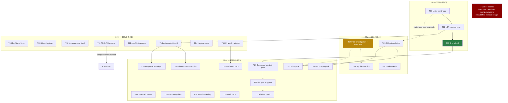

# Pareto Execution Plan: Ship v0.4.0, Kill the Recurring Breaks, and the Depth Surface

**Date:** 2026-09-02 23:59
**Sources:** `TODO_LIST.md` (15 verified open rows, rebuilt 2026-09-02),
ROADMAP.md themes 1–5, status report
`2026-08-29_20-12` section f (50 items, 16 closed by the 2026-09-02 docs-health
pass), status report `2026-09-02_23-55` sections b/c/e/f (session residue).
**Goal:** A repo where the two recurring operational breaks (linter-parity red
masters, vendorHash whack-a-mole) are structurally dead, the accumulated
consumer value (go-sse v0.6.0, ReplaceURLQuerystring, wire goldens, typed
accessors, seven guides) is published as v0.4.0, the LSP/lint warning surface
is zero, and the depth backlog (datastartest helpers, static hardening,
Response tests, guides content) stops rotting in ROADMAP.

**Standing constraints:** an auto-commit daemon commits whatever is dirty
(stage by explicit path list, never `git add -A`); multiple crush sessions
share this checkout; four owner decisions are BLOCKED and must NOT be
actioned (branch deletions, one-bot choice, erraudit-flip verification,
CODEOWNERS naming).

**Format note:** `.md` per explicit user instruction (the pareto-planning
skill's HTML default is overridden; repo convention for plans is `.md` with
mermaid, matching the three prior plans). Sub-task ceiling: **12min** per
user instruction (skill's 15min superseded).

---

## Verschlimmbesserung guards

| Risk | Guard |
| ---- | ----- |
| Daemon commits mid-edit; parallel sessions race | **G1:** `git status` + `git log` immediately before every git-touching step; stage by explicit path list; re-read files before every edit (mod-time races bit twice on 2026-09-02). |
| Partial toolchain/config bumps break the hermetic gate | **G2:** any go.mod/go.work/CI-go-version change lands as ONE atomic change with `go work sync` idempotency + `GOWORK=off` ×3 before commit. |
| Marker-semantics drift (strike ≠ done) | **G3:** strike = done only; open items stay bare; routed items get explicit "Still open — routed" notes, never done-markers (the 2026-09-02 d.1 fuckup). |
| Rewriting released history | **G4:** CHANGELOG released sections are append-only; corrections land in `[Unreleased]` only. |
| Cargo-cult code modernization | **G5:** `encoding/json/v2` migration touches only marshal/unmarshal call sites (no sentinel-error rewrites); `b.Loop()` only where the benchmark body is loop-safe. |
| Pushing to a red master | **G6:** every code push carries local green evidence from the EXACT CI linter build (T01 makes this real); docs-only pushes are exempt (paths filter). |
| Tagging from an unverified tree | **G7:** v0.4.0 tags are irreversible — the release gate runs only after T01+T02 land, all modules green in workspace AND `GOWORK=off`, and `nix flake check` passes at the release commit (the v0.3.0 tag lesson). |
| Wire-format drift while editing tests/helpers | **G8:** `wire_golden_test.go` changes are wire-format changes — deliberate, against the DataStar SDK, recorded in CHANGELOG. |
| Module-boundary regression while touching go.mod files | **G9:** `module_boundary_test.go` must stay green; root must NEVER require datastartest. |
| AGENTS pruning removes load-bearing content | **G10:** prune only resolved-incident material; grep cross-references before deleting any gotcha (G9-of-18-32 lineage). |
| Owner-blocked items actioned by impatience | **G11:** branch deletions, one-bot decision, CODEOWNERS naming, erraudit-flip verification wait for explicit owner answers — listed, never executed. |
| Consolidated ROADMAP ideas become a black hole | **G12:** when executing a consolidated idea (T13, T16, T19, T20), cite the source report items in the commit/CHANGELOG line so the residue stays auditable. |

---

## Step 1: Pareto Breakdown

### The 1% that delivers 51% of the result

Three items, ~2h45. They kill the two break classes that actually bit (red
masters from linter parity, silent warning rot) and publish 16+ days of
unreleased consumer value.

| #    | Item | Why it's 1% | Impact | Effort |
| ---- | ---- | ----------- | ------ | ------ |
| P1-1 | Exact-CI golangci-lint parity app (T01) | The "green locally, red in CI" class caused a red master AND taught the tag-time lesson; one app + one habit kills the entire class | Critical | 30min |
| P1-2 | LSP-warning zero: encoding/json/v2 ×4 + `b.Loop()` ×4 (T02) | The only remaining lint/LSP noise; 8 warnings gone, consistent with the jsonv2 GOEXPERIMENT the repo already requires | High | 45min |
| P1-3 | Ship v0.4.0 (T03) | `[Unreleased]` carries real consumer value (go-sse v0.6.0, ReplaceURLQuerystring, wire goldens, typed accessors, 7 guides, doc.go fixes) — unreleased value is value lost | Critical (customer) | 90min |

**If nothing else is done, P1-1 + P1-2 make the tree clean and unbreakable-by-
parity, and P1-3 publishes it.**

### The 4% that delivers 64% of the result

Add 4 items (~3h40). The operational integrity surface a maintainer trusts:
root-cause the vendorHash whack-a-mole, harden the CI gate, close the two
open verification questions with evidence.

| #    | Item | Why it's 4% | Impact | Effort |
| ---- | ---- | ----------- | ------ | ------ |
| P4-1 | FOD/vendorHash sensitivity investigation + ADR 004 correction (T04) | The hash broke twice under the daemon + once at the tag; today's mechanism claim in ADR 004 is likely wrong; the durable fix ends the hash-dance era | High | 100min |
| P4-2 | CI hygiene batch: go mod verify, version drift, go.work use-match, tidy-check (T05) | Four cheap checks that close known supply-chain/boundary gap classes; requested by three separate reports | Medium-High | 60min |
| P4-3 | Tag `v0.3.0` flake-state verdict via worktree (T06) | Turns the 20-12 report's d.1 incident from inference into recorded evidence; feeds ADR 004 | Medium | 30min |
| P4-4 | `docker build example/` + compose up (T07) | A Dockerfile never built is documentation, not packaging | Medium | 30min |

### The 20% that delivers 80% of the result

Add 8 items (~4h45). The trust-and-polish surface: measurement honesty,
docs leanness, guard robustness, and the first three datastartest helpers.

| #     | Item | Why it's 20% | Impact | Effort |
| ----- | ---- | ------------ | ------ | ------ |
| P20-1 | Performance.md benchtime re-run + prose correction (T08) | Measured docs are the repo's brand; the 100x-sample caveat is known | Medium | 30min |
| P20-2 | Micro-hygiene batch: ticker const, ResponseController, bench headers, PR-template module row (T09) | Four latent-fragility one-liners; the mnd-const prevents a lint regression class | Medium | 45min |
| P20-3 | Measurement ritual: coverage + lint-cache timing documented (T10) | Closes the 12.3 measurement debt; makes the ritual repeatable | Medium | 30min |
| P20-4 | AGENTS.md pruning → ≤15KB (T11) | The AI-session contract grows every session; stale gotchas mislead future sessions | High (session-cost) | 45min |
| P20-5 | module_boundary_test → modfile parsing (T12) | Text-scanning guard is comment-fragile; semantic parse is the production-grade fix | Medium | 30min |
| P20-6 | datastartest top-3 helpers: RequireElementsOrdered, Diff, Snapshot + tests (T13) | The three most-requested missing helpers (four reports); ship the head of the consolidated idea | Medium | 90min |
| P20-7 | Hygiene pack: table realignment + ROADMAP idea cross-refs + git-town observed-branches (T14) | Cosmetic drift, auditability, and a town-abort prevention in one pass | Low-Medium | 45min |
| P20-8 | CI watch runbook (fuzz/CodeQL/nix/Renovate promotion checklist) (T15) | Four new workflows need a documented promote/drop/verify path or they rot unwatched | Medium | 30min |

### The remaining 20% (to reach 100%)

Long tail: Response test-depth, static hardening, datastartest examples and
content packs, decisions pack, infra pack, docs depth (architecture,
starfederation guide, examples), docspec compile-checked snippets, platform
pack (Response ergonomics API, goreleaser, version package, changelog
automation). ~17h, mostly Low-to-Medium impact — sequenced after the tiers.

**Total estimated effort: ~27h30.** The 1% is ~2h45; cumulative 4% ~6h25;
cumulative 20% ~11h10.

---

## Step 2: Comprehensive Plan (30–100min tasks)

27 tasks covering ALL todos (TODO_LIST 15 rows + ROADMAP actionable residue +
status-report f-table remainder). Sorted by importance / impact / effort /
customer-value. Owner-blocked items are listed separately (G11) and NOT
numbered.

| Task | Title | Pareto | Impact | Effort | Depends on | Category | Status |
| ---- | ----- | ------ | ------ | ------ | ---------- | -------- | ------ |
| T01 | Exact-CI linter parity: flake app `go run …/golangci-lint/v2/cmd/golangci-lint@v2.12.2` + CONTRIBUTING pre-push habit | 1% | Critical | 30min | — | Tooling | Ready |
| T02 | LSP-warning zero: `encoding/json/v2` ×4 (inbound.go, signals.go, script_convenience.go, benchmark_test.go) + `b.Loop()` ×4 | 1% | High | 45min | — | Code | Ready |
| T03 | Ship v0.4.0: release-checklist gate, CHANGELOG promote, lockstep tags ×3, GitHub Release, proxy + pkg.go.dev verify | 1% | Critical (customer) | 90min | T01, T02 (G7) | Release | Ready |
| T04 | FOD/vendorHash sensitivity investigation (reproduce hash movement across tree states) + correct ADR 004's mechanism claim | 4% | High | 100min | — | Build | Ready |
| T05 | CI hygiene batch: `go mod verify` step, version-drift detection, `go.work` use-vs-disk check, tidy-check mode in module_boundary_test | 4% | Medium-High | 60min | — | CI | Ready |
| T06 | Tag `v0.3.0` flake-state verdict: `git worktree` of the tag + `nix flake check`; record in ADR 004 + status note | 4% | Medium | 30min | — | Build | Ready |
| T07 | `docker build example/` + `docker compose up` smoke; fix whatever surfaces | 4% | Medium | 30min | — | Packaging | Ready |
| T08 | `docs/performance.md` benchtime re-run (default `-benchtime`) + prose correction | 20% | Medium | 30min | — | Docs | Ready |
| T09 | Micro-hygiene batch: heartbeat ticker named const, `http.NewResponseController` in gzipSSEWriter, stable `.#bench` headers, PR-template multi-module row | 20% | Medium | 45min | — | Code/Repo | Ready |
| T10 | Measurement ritual: coverage re-measure + lint-cache before/after timing, documented in docs/testing.md | 20% | Medium | 30min | — | Docs/CI | Ready |
| T11 | AGENTS.md pruning → ≤15KB: drop resolved-incident gotchas, condense file-layout pointers (G10) | 20% | High (session-cost) | 45min | — | Docs | Ready |
| T12 | module_boundary_test → `golang.org/x/mod/modfile` semantic parsing | 20% | Medium | 30min | — | Testing | Ready |
| T13 | datastartest top-3 helpers + tests: `RequireElementsOrdered`, `Diff`, `Snapshot` (cite source items; G12) | 20% | Medium | 90min | T02 (shared files) | Feature (datastartest) | Ready |
| T14 | Hygiene pack: dprint-style table realignment, ROADMAP consolidated-idea cross-refs, `git config git-town.observed-branches` | 20% | Low-Medium | 45min | — | Repo/Docs | Ready |
| T15 | CI watch runbook: fuzz.yml/CodeQL/nix.yml/Renovate promote-drop-verify checklist in CONTRIBUTING or docs/ | 20% | Medium | 30min | — | CI/Docs | Ready |
| T16 | Response test-depth batch: JSON-parse asserts, integration/fuzz/bench for ErrorResponseFromError, nil/edge/concurrency/large/nested/query+body cases | Rest | Medium | 100min | T13 (test helpers) | Testing | Ready |
| T17 | CodeRabbit thread replies on PR #3 + human review of the 5 parallel commits (`ce3b4bc` set) | Rest | Low-Medium | 45min | — | External/Review | Ready |
| T18 | Community files: SUPPORT.md + DISCUSSION_TEMPLATE.md (CODEOWNERS stays owner-blocked, G11) | Rest | Low | 30min | — | Community | Ready |
| T19 | static hardening batch: provenance comment, bundle checksum test, Last-Modified/nosniff evaluation, ScriptTag edge tests, empty-bundle test, ETag bench, static fuzz targets | Rest | Low-Medium | 100min | — | Feature (static) | Ready |
| T20 | datastartest examples gap: CollectPost/CollectN/DataValue/String function examples | Rest | Low | 60min | T13 | Docs (datastartest) | Ready |
| T21 | Audit pack: README comparison table re-verify vs datastar-go v1.2.2 + spot-check sample of agent-classified verdicts (record ratio) | Rest | Low | 60min | — | Docs/Quality | Ready |
| T22 | Decisions pack: datastartest CHANGELOG question, coverage-floor policy, example/ go.mod, AGENTS CI summary table | Rest | Low | 45min | T15 (context) | Repo | Ready |
| T23 | Infra pack: `go work vendor`/offline flake app + per-module CI matrix/parallel jobs | Rest | Low | 90min | T05 | CI | Ready |
| T24 | Docs depth pack: `docs/architecture.md` diagram (transport→protocol→domain) + `static.Version`↔CHANGELOG constraint check | Rest | Low-Medium | 90min | — | Docs | Ready |
| T25 | Consumer-content pack: starfederation migration guide, Broadcaster typed-filtering example, SubscribeFilter example, playground link | Rest | Medium (customer) | 100min | T03 (version refs) | Docs/Examples | Ready |
| T26 | docspec: compile-checked guide snippets as a test target (`//go:build docspec`) | Rest | Medium | 100min | T25 | Testing/Docs | Ready |
| T27 | Platform pack: Response ergonomics (ErrorResponse-family as methods, signalsMap type — API-change review), goreleaser skeleton, version package, changelog automation evaluation | Rest | Medium | 100min | T03, T26 | API/Platform | Ready |

**Owner-blocked (NOT planned — G11):** delete `pr/docs-test-consolidation`;
rehome/drop `preserve/status-report-coderabbit-pr3`; Renovate-vs-Dependabot
one-bot decision + dashboard/label prefs; CODEOWNERS naming; erraudit
hard-gate flip verification (repo private); monitoring-tier for the status
index; per-item marker depth for consolidated ideas; website launch trigger
(T27-of-18-32 deferral stands).

**Total estimated effort: ~27h30.**

---

## Step 3: Detailed Breakdown (max 12min per task)

### T01: Exact-CI linter parity (30min)

| Sub  | Task | Effort |
| ---- | ---- | ------ |
| 01.1 | Add flake app `lint-ci` running `go run github.com/golangci/golangci-lint/v2/cmd/golangci-lint@v2.12.2 run ./... ./datastartest/... ./static/...` (GOEXPERIMENT set) | 12min |
| 01.2 | Run it at HEAD; confirm 0 issues (parity with CI proven) | 8min |
| 01.3 | Document as THE pre-push lint habit in CONTRIBUTING.md + AGENTS.md Commands block (one line each) | 10min |

### T02: LSP-warning zero (45min)

| Sub  | Task | Effort |
| ---- | ---- | ------ |
| 02.1 | inbound.go:36 → `json.UnmarshalRead` (encoding/json/v2; GOEXPERIMENT already required) | 10min |
| 02.2 | signals.go:86 + script_convenience.go:105 → `json.MarshalWrite`/`MarshalRead` equivalents where the call shape allows; verify behavior unchanged | 12min |
| 02.3 | benchmark_test.go:92 → `json.UnmarshalRead` | 8min |
| 02.4 | benchmark_test.go ×4 → `for b.Loop()` (verify per-iteration reset semantics — G5) | 12min |
| 02.5 | Full gate: build/vet/race + `go test ./... -bench` smoke; LSP diagnostics zero | 3min |

### T03: Ship v0.4.0 (90min) — after T01+T02 (G7)

| Sub  | Task | Effort |
| ---- | ---- | ------ |
| 03.1 | Run docs/release-checklist.md pre-release gate (workspace + isolation ×3 + flake) | 12min |
| 03.2 | Sweep pending `[Unreleased]` items into the release: T02 fixes noted; verify goldens/accessors/ReplaceURLQuerystring/guides entries are complete and dated | 10min |
| 03.3 | Finalize CHANGELOG `## [0.4.0] - <date>` + compare links | 8min |
| 03.4 | Version bumps ×3 per checklist (root v0.4.0; static/datastartest per their versioning) + datastartest require bump | 12min |
| 03.5 | `nix flake check` at the release commit (vendorHash re-discovery if the requires bump moved it — G7) | 12min |
| 03.6 | Tag ×3 lockstep + push tags | 8min |
| 03.7 | GitHub Release with CHANGELOG excerpt | 8min |
| 03.8 | Verify proxy `go get` + pkg.go.dev renders all 3 modules; update FEATURES release row | 10min |
| 03.9 | Re-verify README comparison table against upstream datastar-go (quarterly item folded here) | 10min |

### T04: FOD/vendorHash investigation + ADR 004 correction (100min)

| Sub  | Task | Effort |
| ---- | ---- | ------ |
| 04.1 | Reproduce: hash a minimal FOD (go.mod/go.sum only) vs the current gitTracked fileset for a known tree pair | 12min |
| 04.2 | Toggle one source file with identical go.mod/go.sum; re-hash; record whether the FOD moves | 12min |
| 04.3 | Repeat with the local `replace => ..` directives removed (temporary edit) to isolate the replace-under-proxyVendor hypothesis | 12min |
| 04.4 | Write up the confirmed mechanism (or the disproof) with the experiment matrix | 12min |
| 04.5 | Correct ADR 004: replace the "only Go patch bumps" claim; document the durable mitigation (minimal src fileset vs accept-and-dance) | 12min |
| 04.6 | Update AGENTS.md Nix gotcha to match the corrected mechanism | 8min |
| 04.7 | Fold T06's tag verdict into the same ADR section (evidence table) | 10min |
| 04.8 | Decision note: implement minimal-fileset FOD now (T23 candidate) or accept documented dance | 10min |

### T05: CI hygiene batch (60min)

| Sub  | Task | Effort |
| ---- | ---- | ------ |
| 05.1 | Add `go mod verify` step (all 3 modules) to ci.yml test job | 10min |
| 05.2 | Add version-drift check: assert static.Version in code matches the latest CHANGELOG-referenced version (reuse pattern from T24's constraint check) | 12min |
| 05.3 | Add `go.work` use-vs-disk check (diff `go work use` output against committed go.work) | 12min |
| 05.4 | Extend module_boundary_test with a tidy-check mode (`go mod tidy` dry diff via go mod edit fallback — no network) | 12min |
| 05.5 | actionlint + full CI-prep run locally (captured exit codes); commit | 8min |

### T06: Tag v0.3.0 flake verdict (30min)

| Sub  | Task | Effort |
| ---- | ---- | ------ |
| 06.1 | `git worktree add /tmp/gds-v0.3.0 v0.3.0` | 5min |
| 06.2 | `nix flake check` in the worktree; capture the exact failure output | 12min |
| 06.3 | Record verdict (expected FAIL per 20-12 d.1) in the T04 evidence table; remove worktree | 10min |

### T07: Docker packaging verify (30min)

| Sub  | Task | Effort |
| ---- | ---- | ------ |
| 07.1 | `docker build -t go-datastar-example example/` | 12min |
| 07.2 | `docker compose up` smoke; curl the SSE endpoint; compose down | 10min |
| 07.3 | Fix whatever surfaces (base image, GOEXPERIMENT build arg, port map); re-run | 8min |

### T08: Performance benchtime re-run (30min)

| Sub  | Task | Effort |
| ---- | ---- | ------ |
| 08.1 | `go test -bench=. -benchmem -benchtime=1s` root + datastartest (default benchtime for stable stats) | 10min |
| 08.2 | Update docs/performance.md tables + drop the small-sample caveat | 10min |
| 08.3 | Note methodology (benchtime, machine class) in the doc footer | 8min |

### T09: Micro-hygiene batch (45min)

| Sub  | Task | Effort |
| ---- | ---- | ------ |
| 09.1 | example/main.go producer ticker 2s → named constant; drop the mnd ignore if now unnecessary | 10min |
| 09.2 | gzipSSEWriter → `http.NewResponseController` for flush-depth correctness | 12min |
| 09.3 | `nix run .#bench` stable headers (machine/go version line) | 10min |
| 09.4 | PR template: add the datastartest/static GOWORK=off row | 8min |

### T10: Measurement ritual (30min)

| Sub  | Task | Effort |
| ---- | ---- | ------ |
| 10.1 | Capture lint-cache before/after timing (clear cache, run lint, re-run) | 12min |
| 10.2 | Document the coverage re-measure + cache-timing ritual in docs/testing.md (one short section) | 10min |
| 10.3 | Update FEATURES Testing row if numbers moved | 8min |

### T11: AGENTS.md pruning → ≤15KB (45min) — G10

| Sub  | Task | Effort |
| ---- | ---- | ------ |
| 11.1 | Grep cross-references for each gotcha; list removal candidates (protected-master ceremony residue, resolved incidents) | 10min |
| 11.2 | Condense file-layout table to pointers (doc.go / datastartest README) | 10min |
| 11.3 | Merge overlapping gotchas (daemon, shared checkout, git-town) into one "shared checkout" section | 12min |
| 11.4 | `wc -c` ≤15,360; final read-through for load-bearing content | 10min |

### T12: module_boundary modfile upgrade (30min)

| Sub  | Task | Effort |
| ---- | ---- | ------ |
| 12.1 | Add `golang.org/x/mod` to root go.mod (test-only use) | 8min |
| 12.2 | Rewrite the guard with modfile.Parse over Require blocks (comment-safe) | 12min |
| 12.3 | Run test in workspace + GOWORK=off modes; keep the textual check as a fallback? — no, replace; run full gate | 10min |

### T13: datastartest top-3 helpers (90min) — G12

| Sub  | Task | Effort |
| ---- | ---- | ------ |
| 13.1 | API sketch in datastartest (assert.go placement, testing.TB signatures) | 10min |
| 13.2 | Implement `RequireElementsOrdered(events, ...want[])` + failure messages | 12min |
| 13.3 | Tests for RequireElementsOrdered (pass/fail/order-mismatch) | 12min |
| 13.4 | Implement `Diff(want, got []Event)` (EventsString-based unified diff) | 12min |
| 13.5 | Tests for Diff | 10min |
| 13.6 | Implement `Snapshot(tb, events)` (golden-file helper under testdata/, `-update` flag) | 12min |
| 13.7 | Tests for Snapshot + `-update` round trip | 10min |
| 13.8 | datastartest/README.md section + CHANGELOG `[Unreleased]` entry citing source report items (G12); full gate | 12min |

### T14: Hygiene pack (45min)

| Sub  | Task | Effort |
| ---- | ---- | ------ |
| 14.1 | dprint-style realignment of the hand-edited tables (README, FEATURES, TODO_LIST) | 12min |
| 14.2 | ROADMAP consolidated ideas: append "(from <report> #N)" cross-refs | 12min |
| 14.3 | `git config --add git-town.observed-branches preserve/status-report-coderabbit-pr3` | 5min |
| 14.4 | Verify `git town status` no longer aborts on the observed branch | 10min |

### T15: CI watch runbook (30min)

| Sub  | Task | Effort |
| ---- | ---- | ------ |
| 15.1 | Write the promote/drop/verify checklist for nix.yml (green week → drop continue-on-error), fuzz.yml (artifact path + first-run), codeql.yml (first results triage), Renovate (regex vs real upstream tags; label/schedule tuning) | 12min |
| 15.2 | Place it in CONTRIBUTING.md (CI section) or docs/ci-watch.md + link from AGENTS CI section | 10min |
| 15.3 | Convert TODO_LIST watch row to reference the runbook | 8min |

### T16: Response test-depth batch (100min)

| Sub  | Task | Effort |
| ---- | ---- | ------ |
| 16.1 | TestErrorResponseFromError → parse JSON, assert typed fields (drop assertContains) | 12min |
| 16.2 | Nil-error case for ErrorResponseFromError + nil-detail Event for DispatchCustomEvent | 12min |
| 16.3 | ErrorResponse/NotificationResponse edge cases: empty, unicode, very long, empty code | 12min |
| 16.4 | Concurrent Response method calls test (single Response, parallel sends) | 12min |
| 16.5 | Large multi-line elements patch test (scale splitting) | 12min |
| 16.6 | Nested outbound signals patch test | 12min |
| 16.7 | ReadSignals query+body simultaneous precedence test | 12min |
| 16.8 | ErrorResponseFromError integration test in datastartest E2E + fuzz target + benchmark (if budget allows; else T27 residue) | 16min |

### T17: External closure (45min)

| Sub  | Task | Effort |
| ---- | ---- | ------ |
| 17.1 | Reply to the 5 CodeRabbit threads on PR #3 (mention fixes landed in `ed815c7`) | 20min |
| 17.2 | Read the 5 parallel-session commits (`ed815c7`, `ce3b4bc`, `66a637e`, `ffeedea`, `52cfac8`, `7dec1d3`); note anything suspicious | 20min |
| 17.3 | Record the review outcome in a status-report line (or close silently if clean) | 5min |

### T18: Community files (30min)

| Sub  | Task | Effort |
| ---- | ---- | ------ |
| 18.1 | SUPPORT.md (point to GitHub Issues/Discussions + expected response norms) | 12min |
| 18.2 | .github/DISCUSSION_TEMPLATE.md (Q&A / show-and-tell) | 12min |
| 18.3 | CODEOWNERS placeholder decision note → owner (G11; do NOT create without names) | 6min |

### T19: static hardening batch (100min)

| Sub  | Task | Effort |
| ---- | ---- | ------ |
| 19.1 | Upstream provenance comment in static/static.go (source repo + tag + fetch command) | 10min |
| 19.2 | Bundle checksum test (SHA256 constant vs Bytes()) | 12min |
| 19.3 | ScriptHandler: add nosniff + evaluate Last-Modified (fixed epoch = bundle version) | 12min |
| 19.4 | ScriptTag edge tests (empty path, query, fragment) | 12min |
| 19.5 | TestScriptHandlerWith empty-bundle case | 10min |
| 19.6 | computeETag benchmark + cache evaluation (per-call vs init) | 12min |
| 19.7 | Add static bundle to fuzz.yml matrix (FuzzStaticBytes? — only if meaningful; else record Not-Do reason) | 12min |
| 19.8 | `DatastarJSVersion` // Deprecated: comment; CHANGELOG entry | 10min |

### T20: datastartest examples gap (60min)

| Sub  | Task | Effort |
| ---- | ---- | ------ |
| 20.1 | ExampleCollectPost + ExampleCollectN | 12min |
| 20.2 | ExampleDataValue + ExampleEvent_string (String) | 12min |
| 20.3 | Run examples (output assertions); fix flakes | 12min |
| 20.4 | datastartest/README.md examples cross-links | 10min |
| 20.5 | Coverage re-measure (ritual from T10); update FEATURES if moved | 10min |

### T21: Audit pack (60min)

| Sub  | Task | Effort |
| ---- | ---- | ------ |
| 21.1 | Re-verify README comparison table vs datastar-go v1.2.2 source (method-by-method) | 25min |
| 21.2 | Spot-check 10% sample of agent-classified verdicts from the 08-10 reports (record pass/fail) | 20min |
| 21.3 | Record the sample ratio + result in the 2026-09-02 report's appendix (ANNOTATE inline) | 10min |

### T22: Decisions pack (45min)

| Sub  | Task | Effort |
| ---- | ---- | ------ |
| 22.1 | datastartest CHANGELOG: decide root-sections vs module file; record decision (ADR note or ROADMAP resolved question) | 12min |
| 22.2 | Coverage-floor policy: decide (no gate / soft floor per ADR 005); record | 10min |
| 22.3 | example/ go.mod: decide stay-in-root (likely); record rationale in ADR 002 addendum | 10min |
| 22.4 | AGENTS CI summary table (post-promotion placeholder) | 10min |

### T23: Infra pack (90min)

| Sub  | Task | Effort |
| ---- | ---- | ------ |
| 23.1 | Evaluate `go work vendor` viability (Go 1.26 support check) | 12min |
| 23.2 | Flake app `vendor-offline` (or record Not-Do with reason) | 12min |
| 23.3 | Split ci.yml test job into per-module matrix jobs (root/static/datastartest) | 12min |
| 23.4 | Keep sync-idempotency + replace-audit as a separate workspace job | 12min |
| 23.5 | Verify actionlint + local matrix dry-run; measure job-time delta | 12min |
| 23.6 | CHANGELOG + CONTRIBUTING notes for the new CI shape | 10min |

### T24: Docs depth pack (90min)

| Sub  | Task | Effort |
| ---- | ---- | ------ |
| 24.1 | docs/architecture.md: mermaid diagram transport→protocol→domain | 12min |
| 24.2 | Walk each layer's key types with file:line pointers | 12min |
| 24.3 | Link from README Documentation section + AGENTS Docs Map | 8min |
| 24.4 | static.Version↔CHANGELOG constraint check: small test scanning CHANGELOG for the pinned version (T05.2 shares this) | 12min |
| 24.5 | Wire the check into CI (fold with T05.2 if done there; else standalone step) | 12min |
| 24.6 | Link the constraint check from docs/static-js.md | 10min |

### T25: Consumer-content pack (100min) — after T03 (version refs)

| Sub  | Task | Effort |
| ---- | ---- | ------ |
| 25.1 | docs/migration-starfederation.md: upstream SDK → go-datastar mapping guide | 12min |
| 25.2 | The "why patches as values" section with the domain-adapter pointer | 12min |
| 25.3 | Broadcaster[datastar.Patch] typed-filtering example (example/broadcast_filter.go or docs snippet) | 12min |
| 25.4 | SubscribeFilter usage example | 12min |
| 25.5 | Testable examples for both (example_test.go) | 12min |
| 25.6 | Playground/tutorial link section in README (link only — no external deploy) | 8min |
| 25.7 | Link all new content from README Documentation + AGENTS Docs Map | 8min |

### T26: docspec compile-checked snippets (100min)

| Sub  | Task | Effort |
| ---- | ---- | ------ |
| 26.1 | Design: `//go:build docspec` test file compiling guide snippets as Go code | 12min |
| 26.2 | Extract BroadcastMany + Heartbeat + middleware snippets from docs/replay.md + example/README.md into compile-checked form | 12min |
| 26.3 | Wire-format + testing guide snippets next | 12min |
| 26.4 | Error-system + migration-guide snippets | 12min |
| 26.5 | Wire docspec into `go test` tags (default-off, CI job or flake app) | 12min |
| 26.6 | Document the docspec contract in CONTRIBUTING.md | 10min |
| 26.7 | Verify: deliberately break one snippet → test fails; restore | 10min |

### T27: Platform pack (100min) — API-review heavy

| Sub  | Task | Effort |
| ---- | ---- | ------ |
| 27.1 | Response ergonomics API review: ErrorResponse/NotificationResponse/ErrorResponseFromError as Response methods — breaking-change assessment | 12min |
| 27.2 | If go: implement methods (old functions kept as deprecated wrappers) + tests | 12min |
| 27.3 | signalsMap type prototype for the signals-patch pattern; decide ship/hold | 12min |
| 27.4 | goreleaser skeleton (.goreleaser.yaml) for tag-triggered releases (dry-run only) | 12min |
| 27.5 | `version` package (build-time var) + ldflags note in CONTRIBUTING | 12min |
| 27.6 | changelog automation evaluation (changie vs github-native); record decision | 12min |
| 27.7 | CHANGELOG + ROADMAP updates for everything shipped; full gate | 12min |

---

## Execution graph

**Parallel lanes (daemon-safe):** lane A = T01→T02→T03 (release spine);
lane B = T04→T06 (nix knowledge); lane C = T05→T23 (CI); lane D =
T13→T16/T20 (datastartest). Lanes A–D touch disjoint files except the shared
gate — merge through the full gate each time (G1/G6).

---

_Sources: TODO_LIST.md (2026-09-02 rebuild), ROADMAP.md themes, status
reports 2026-08-29_20-12 + 2026-09-02_23-55. Owner questions from the
2026-09-02 report's g) section remain open (status-index tiers, consolidation
depth, AGENTS size — T11 adopts a default prune; re-confirm)._
