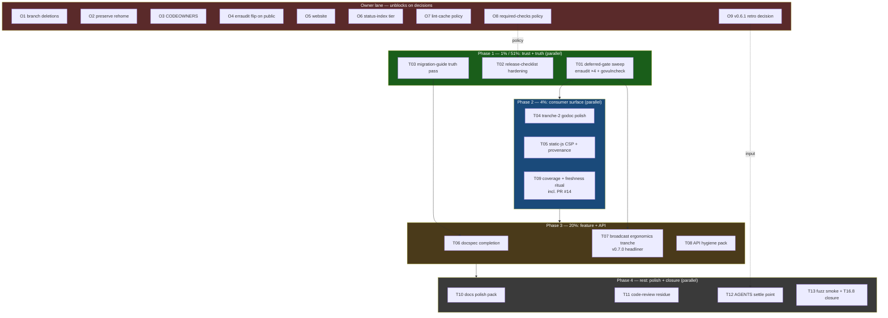

# Pareto Execution Plan: Trust Gates, Docs Truth, Broadcast v0.7.0 Prep

**Date:** 2026-10-01 04:59 CEST · **HEAD:** `e22d883` (clean, master ahead of origin)
**Input:** `TODO_LIST.md` 2026-10-01 (18 next-up + 8 owner-blocked rows, post
docs-health rebuild + the parallel session's one-bot settlement) + the
2026-10-01_04-37 report's f-list residue. **Repo state:** v0.6.1 released;
master gates green after the 2026-10-01 red-master repair (go-branded-id tidy
drift + 3 vendor hashes); `renovate.json` scoped to the regex manager only.

**Goal:** convert the entire verified backlog into executed, gated work —
truth-restoring docs first (they mislead today), the deferred audit gates
second (three releases shipped without them), the broadcast ergonomics
tranche third (the only feature work, and the v0.7.0 headliner).

## Verschlimmbesserung guards (binding)

- **G1 — No breaking API changes.** T07/T08 are additive-only (v0.x callers
  must keep compiling). Removals (e.g. `ScriptHandlerWith`'s param) need an
  owner decision first.
- **G2 — CHANGELOG `[Unreleased]`** for anything user-visible, same commit.
- **G3 — Full local gate BEFORE commit** (race, vet, isolation ×4,
  tidy-diff, lint, `nix flake check` when go.mod/flake inputs moved) — the
  2026-10-01 session violated this once; do not repeat.
- **G4 — Daemon-aware staging:** explicit path lists, re-read before re-edit,
  `git status` before every `git add`.
- **G5 — Docspec contract:** any doc-snippet change updates snippet + mirror
  in one commit.
- **G6 — Owner-gated rows stay gated** (broadcast public API shape, release
  cuts). T07 executes only with the standing "next minor" approval already
  given in the 2026-09-18 scope answer; anything beyond R1–R3 waits.
- **G7 — Nix hash rules:** ANY `go.mod`/`go.sum` edit → `nix flake check
  --keep-going`, paste EVERY moved hash, same commit.
- **G8 — Shared checkout:** parallel sessions are live (one-bot edits landed
  mid-session); re-diff TODO_LIST/AGENTS before editing them.

## Step 1: Pareto Breakdown

### The 1% that delivers 51%

| #  | Task                                    | Why it is more than half the value                                                                                                                                                     |
| -- | --------------------------------------- | ------------------------------------------------------------------------------------------------------------------------------------------------------------------------------------- |
| A  | **Deferred-gate sweep (T01)**           | erraudit skipped at v0.5.0 AND v0.6.0 AND by the 2026-10-01 session's own go.mod commits; govulncheck never saw go-branded-id v0.7.0's newly vendored code. A real finding here is master-red-class. Cheap, urgent, trust. |
| B  | **Release-checklist hardening (T02)**   | The checklist's gaps caused two documented red-master incidents (v0.6.0's permanent red prep run; 2026-09-29's unnoticed stale hash). Every future release inherits these fixes — compounding. |
| C  | **Migration-guide truth pass (T03)**    | `docs/migration-guide.md` tells TODAY's upgraders to pin Go 1.26.7 and set `GOEXPERIMENT=jsonv2` — both false since v0.6.1. An actively wrong customer-facing doc.                      |

### The 4% that delivers 64% (1% + these)

| #  | Task                              | Incremental value                                                                                       |
| -- | --------------------------------- | ------------------------------------------------------------------------------------------------------- |
| D  | Tranche-2 godoc polish (T04)      | pkg.go.dev is the shop window; the six v0.6.0 helpers have zero examples and one has no doc at all.    |
| E  | static-js consumer docs (T05)     | CSP-mode (`data-nonce`) is a shipped upstream capability nobody can discover; provenance script kills the mangled-bundle class. |
| F  | Docspec completion (T06)          | Wire-format.md + migration-guide.md snippets can silently drift; mirroring them kills the whole class. |

### The 20% that delivers 80% (4% + these)

| #  | Task                                     | Incremental value                                                                                  |
| -- | ---------------------------------------- | --------------------------------------------------------------------------------------------------- |
| G  | Broadcast ergonomics tranche (T07)       | The only feature work; the v0.7.0 headliner (store-injection seam, constructor matrix, heartbeat). |
| H  | API hygiene pack (T08)                   | `Version()` returning a deprecated const, unused param, hardcoded version literal, untested package. |
| I  | Coverage + freshness ritual (T09)        | PR #14 merge, datastartest coverage number, upstream comparison freshness, README note.            |
| J  | Docs polish pack (T10)                   | gzip pattern promotion, ldflags doc, `--keep-going` AGENTS note.                                    |

### The remaining 20% to reach 100%

K (T11) code-review residue (nestif, silent_swallow) · L (T12) AGENTS settle
point · M (T13) T16.8 closure + fuzz smoke · **Owner lane (O1–O9)**: branch
deletions, preserve rehome, CODEOWNERS, erraudit flip-on-public, website,
status-index Monitoring tier, shared lint-cache policy, required-checks
policy, v0.6.1 retro-report decision.

## Step 2: Comprehensive Plan (30–100min tasks)

| Task | Title                                                                                                    | Tier    | Impact              | Effort | Depends on     | Category               | Status  |
| ---- | -------------------------------------------------------------------------------------------------------- | ------- | ------------------- | ------ | -------------- | ---------------------- | ------- |
| T01  | Deferred-gate sweep: erraudit ×4 modules + govulncheck at HEAD; reconcile findings with `.golangci.yml`  | 1%      | High (trust)        | 30min  | —              | Quality                | Ready   |
| T02  | Release-checklist hardening: §2.5 post-bump nix `--keep-going` + every-hash; phantom `go mod edit -version` fix; explicit tag refs; Latest=root; tag-annotation check; proxy Origin.Hash + consumer smoke steps | 1% | High (compounding)  | 60min  | —              | Process/Release        | Ready   |
| T03  | Migration-guide truth pass: 1.27.1 floor, GOEXPERIMENT removed, v0.5.0→v0.6.x section                    | 1%      | High (customer)     | 30min  | —              | Docs                   | Ready   |
| T04  | datastartest tranche-2 polish: `FindAllElements` godoc + six `Example*` functions                         | 4%      | Medium-High         | 45min  | —              | Docs (datastartest)    | Ready   |
| T05  | static-js consumer docs: CSP mode, minified-only policy, v1.0.3 scope note, `fetch-bundle.sh`             | 4%      | Medium-High         | 45min  | —              | Docs/Tooling           | Ready   |
| T06  | Docspec completion: mirror wire-format.md + migration-guide.md; fix testing.md quick-start divergence; T16.8 written Not-Do or fuzz target | 4% | Medium-High         | 60min  | T03 (guide text settled) | Testing/Docs     | Ready   |
| T07  | Broadcast ergonomics tranche: `NewBroadcasterWithStore` seam (NO backends), constructor-matrix close, optional heartbeat interval + tests + docs + CHANGELOG | 20% | Medium-High (v0.7.0 headliner) | 90min | T01 (gates green), G6 owner scope | Feature (broadcast) | Ready |
| T08  | API hygiene pack: `Version()`/deprecated-const review, `ScriptHandlerWith` param decision, response_test version derivation, `version` pkg test | 20% | Medium | 45min | — | Code/API | Ready |
| T09  | Coverage + freshness ritual: merge PR #14, datastartest coverage re-measure, upstream datastar-go check, datastartest README v0.6.0 note | 20% | Medium | 30min | — | CI/Docs | Ready |
| T10  | Docs polish pack: gzip middleware promotion, version-ldflags doc page, AGENTS `--keep-going` note         | 20%     | Low-Medium          | 30min  | —              | Docs                   | Ready   |
| T11  | Code-review residue: `ReadSignals` nestif review, example `silent_swallow`                               | Rest    | Low                 | 30min  | —              | Code                   | Ready   |
| T12  | AGENTS.md settle point: prune to ≤15KB (git-town detail, CI history) or accept the 15–30KB band + update the TODO trigger | Rest | Low-Medium | 30min | O9 input welcome | Docs | Ready |
| T13  | Fuzz smoke: FuzzReadSignals 30s + FuzzReadEvents 30s; commit any new seeds                                | Rest    | Low                 | 30min  | —              | Quality                | Ready   |
| O1   | Delete `pr/docs-test-consolidation` (local+remote)                                                        | Owner   | Medium              | 5min   | owner nod      | Repo                   | BLOCKED |
| O2   | Rehome or drop `preserve/status-report-coderabbit-pr3`                                                    | Owner   | Medium              | 15min  | owner decision | Repo                   | BLOCKED |
| O3   | CODEOWNERS with named owners                                                                             | Owner   | Low                 | 10min  | owner naming   | Community              | BLOCKED |
| O4   | erraudit CI flip verification on repo publication                                                        | Owner   | Low                 | 5min   | repo goes public | CI                   | BLOCKED |
| O5   | Website launch (Astro + Starlight)                                                                       | Owner   | Low                 | —      | owner trigger  | Community              | BLOCKED |
| O6   | Status-index "Monitoring" tier                                                                            | Owner   | Low                 | 15min  | owner decision | Docs                   | BLOCKED |
| O7   | Shared lint-cache policy (purge vs bless mktemp default)                                                  | Owner   | Low                 | 5min   | owner decision | Tooling                | BLOCKED |
| O8   | Required-checks policy ("local gates are the gate" canonified)                                            | Owner   | Low                 | 15min  | owner decision | CI                     | BLOCKED |
| O9   | v0.6.1 retro report: write from CHANGELOG+git evidence, or waive (CHANGELOG is the record)                | Owner   | Low-Medium          | 30min  | owner decision | Docs                   | BLOCKED |

**Execution order:** Phase 1 (parallel): T01 + T02 + T03 · Phase 2 (parallel):
T04 + T05 + T09 · Phase 3: T06 (after T03) then T07 (after T01) + T08 ·
Phase 4 (parallel): T10 + T11 + T12 + T13. Owner lane whenever answers land.

## Step 3: Detailed Breakdown (≤12min micro-tasks)

| #     | Micro-task                                                                                                              | ≤ min | Parent |
| ----- | ----------------------------------------------------------------------------------------------------------------------- | ----- | ------ |
| 01.1  | erraudit root module (`erraudit . --type-aware --enforce-go-error-family --no-suppress`)                                 | 5     | T01    |
| 01.2  | erraudit broadcast module                                                                                                | 5     | T01    |
| 01.3  | erraudit datastartest module                                                                                             | 5     | T01    |
| 01.4  | erraudit static module                                                                                                   | 5     | T01    |
| 01.5  | `nix run .#govulncheck` (or pinned `go run`) at HEAD — first run against go-branded-id v0.7.0                            | 10    | T01    |
| 01.6  | Reconcile findings vs `.golangci.yml` excludes; fix on sight or record tolerated patterns in AGENTS                       | 10    | T01    |
| 02.1  | Re-read checklist + the 2026-09-18_22-29 §b1/e1–e7 lessons; draft §2.5 text                                              | 10    | T02    |
| 02.2  | Insert §2.5: post-require-bump `nix flake check --keep-going`, paste EVERY moved hash, green before tagging              | 10    | T02    |
| 02.3  | Replace phantom `go mod edit -version` (line 21) with the real sibling-require `-require=mod@vX.Y.Z` procedure           | 10    | T02    |
| 02.4  | Replace `git push --tags` with the explicit lockstep ref list                                                            | 5     | T02    |
| 02.5  | Add "verify GitHub Latest = root release (create root last)" step                                                        | 5     | T02    |
| 02.6  | Add tag-annotation convention check (`%(objecttype)==tag` for all tags) step                                             | 5     | T02    |
| 02.7  | Add proxy `.info` Origin.Hash verification + clean-cache consumer smoke steps                                            | 10    | T02    |
| 02.8  | Add erraudit + fresh-cache-lint gate rows (marked owner-policy pending)                                                  | 5     | T02    |
| 02.9  | Dry-run the hardened checklist against the actual v0.6.1 release steps; fix anything that would have stalled             | 10    | T02    |
| 03.1  | Fix toolchain claim: "Go 1.27.1+ required; GOEXPERIMENT=jsonv2 no longer needed"                                         | 10    | T03    |
| 03.2  | Add v0.5.0→v0.6.x migration section (broadcast module, tranche-2 helpers, nix promotion, 1.27.1 floor)                   | 12    | T03    |
| 03.3  | Verify no docspec-mirrored snippet drifted; run `nix run .#docspec`                                                      | 5     | T03    |
| 04.1  | `FindAllElements` godoc: script patches participate (they are elements patches)                                          | 5     | T04    |
| 04.2  | `ExampleRequireNotScript` with `// Output:` block                                                                        | 10    | T04    |
| 04.3  | `ExampleFindScript` with `// Output:` block                                                                              | 5     | T04    |
| 04.4  | `ExampleFindAllElements` (stream order, plural semantics)                                                                | 10    | T04    |
| 04.5  | `ExampleEventToSelectorMap` (last-patch-wins semantics)                                                                  | 10    | T04    |
| 04.6  | `ExampleCollectPostWithTimeout` + `ExampleCollectWithRequestWithTimeout` (partial-events contract)                       | 12    | T04    |
| 05.1  | static-js.md: CSP-mode section (`data-nonce`, no `unsafe-eval`, consumer opt-in)                                         | 12    | T05    |
| 05.2  | static-js.md: canonical-minified-only policy note (no beautified variants in-repo)                                       | 5     | T05    |
| 05.3  | static-js.md: v1.0.3 scope note (client-runtime changes, wire-format safe — goldens green)                               | 5     | T05    |
| 05.4  | Write `static/fetch-bundle.sh` (download at tag, print sha256, emit provenance comment)                                  | 12    | T05    |
| 05.5  | Exercise fetch-bundle.sh once in a scratch dir; verify sha256 matches the pin                                            | 10    | T05    |
| 06.1  | Inventory wire-format.md code snippets worth mirroring                                                                   | 5     | T06    |
| 06.2  | Mirror wire-format.md snippets behind `//go:build docspec`                                                               | 12    | T06    |
| 06.3  | Inventory + mirror migration-guide.md snippets (post-T03 text)                                                           | 12    | T06    |
| 06.4  | Fix docs/testing.md quick-start: add `WithModeAppend` to the DOC (not the mirror)                                        | 5     | T06    |
| 06.5  | Re-run `nix run .#docspec` green; CHANGELOG Fixed entry for the doc fix                                                  | 10    | T06    |
| 07.1  | Design `NewBroadcasterWithStore(sse.EventStore)` seam: validation (nil store → default?), doc contract (consumer-owned)  | 12    | T07    |
| 07.2  | Implement the constructor; wire the store field through `NewBroadcasterWithReplay` path                                  | 12    | T07    |
| 07.3  | Close constructor matrix: buffer-size × store orthogonality (functional option or combined constructor, additive)         | 12    | T07    |
| 07.4  | Optional heartbeat-interval option (default const unchanged; YAGNI note honored — it now has a consumer ask)              | 10    | T07    |
| 07.5  | Test: injected recording store observes append-BEFORE-fan-out                                                           | 12    | T07    |
| 07.6  | Test: table-driven constructor × (Broadcast/BroadcastMany/BroadcastEvent) matrix                                         | 12    | T07    |
| 07.7  | Test: heartbeat option with fast interval (unlocks the 21-02 f4 idea)                                                    | 10    | T07    |
| 07.8  | Docs: broadcast README + doc.go rows; AGENTS file-layout note if needed                                                  | 10    | T07    |
| 07.9  | CHANGELOG `[Unreleased]` Added — broadcast; full gate (race ×5 for broadcast); commit                                    | 10    | T07    |
| 08.1  | Decide `Version()` returning deprecated `DatastarJSVersion` (script_handler.go:81): keep + doc, or re-point to `static.Version` | 12 | T08 |
| 08.2  | `ScriptHandlerWith` unused `_ string` param: decide remove (v0.7.0 candidate) vs use; record in ADR/CHANGELOG if API-visible | 10 | T08 |
| 08.3  | response_test.go: derive `"1.0.3"` assertion from `static.Version`                                                       | 10    | T08    |
| 08.4  | `version/version_test.go`: default "dev" + ldflags override documentation test                                           | 10    | T08    |
| 08.5  | Gate + CHANGELOG entries for anything API-visible                                                                        | 5     | T08    |
| 09.1  | Merge dependabot PR #14 (codeql-action analyze SHA; checks green); post-merge actionlint + CodeQL watch                  | 10    | T09    |
| 09.2  | Re-measure datastartest coverage (`go test -cover`); record number for the next CHANGELOG entry                          | 10    | T09    |
| 09.3  | Check upstream datastar-go for >v1.2.2; refresh README comparison + footnote if newer                                    | 10    | T09    |
| 09.4  | datastartest README: "arrived in v0.6.0" note for the tranche-2 helpers                                                   | 5     | T09    |
| 10.1  | Promote gzip-SSE middleware: README comparison row link + docs pointer                                                   | 10    | T10    |
| 10.2  | Write the `version`-package ldflags doc page (docs/version.md or README section)                                         | 10    | T10    |
| 10.3  | AGENTS.md: make `--keep-going` the documented hash-collection step in the nix gotcha                                     | 5     | T10    |
| 11.1  | `ReadSignals` nestif review: early-return refactor or documented acceptance                                                                              | 12    | T11    |
| 11.2  | example `silent_swallow` (main.go): fix or add the tolerated-pattern note                                                                                | 10    | T11    |
| 12.1  | AGENTS prune inventory: git-town recovery detail, CI bullet history, redundant cross-refs                                                                | 10    | T12    |
| 12.2  | Apply the prune to ≤15KB OR write the settle-point decision (accept 15–30KB band)                                                                        | 10    | T12    |
| 12.3  | Update the TODO_LIST trigger wording to match the decision                                                                                               | 5     | T12    |
| 13.1  | T16.8 closure: ~15-line `FuzzErrorResponseFromError` target OR a written Not-Do in CHANGELOG/ADR                                                                                          | 12    | T13    |
| 13.2  | Fuzz smoke: `FuzzReadSignals` 30s; commit new seeds if any                                                                                               | 12    | T13    |
| 13.3  | Fuzz smoke: `FuzzReadEvents` 30s (datastartest); commit new seeds if any                                                                                 | 12    | T13    |

_Owner-lane micro-breakdowns omitted — each row is a single ≤15min decision
or action once unblocked (see TODO_LIST Owner-blocked section)._

## Execution graph

**Standing rule for every task:** guards G1–G8; full local gate before each
commit (G3); CHANGELOG `[Unreleased]` for user-visible changes (G2); stage by
explicit path list (G4); docspec contract on snippet touches (G5).

## Sources

- `TODO_LIST.md` (2026-10-01, 18 next-up + 8 owner-blocked rows — post
  docs-health rebuild, post one-bot settlement)
- `docs/status/2026-10-01_04-37_docs-health-audit-red-master-repair.md` §f
  (items 1–2 = T01; 13 = 02.3-adjacent; 21 → T08; 27 → T13)
- `docs/status/2026-09-18_22-29` §b1/§e (T02 raw material), `2026-09-18_19-54`
  R1–R3 (T07), `2026-09-18_21-02` §b5/§e7 (T04), `2026-09-03_15-44` §c (T05),
  `2026-09-03_12-26` §b2/§b3 (T06)
- ROADMAP themes 1–5 (raw-idea parking lot — deliberately NOT task-ified here)
