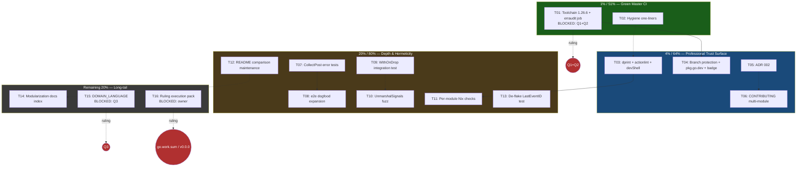

# Pareto Execution Plan: CI Trust Recovery & Hardening

**Date:** 2026-08-16 08:53
**Sources:** `TODO_LIST.md` (19 open rows), status report `2026-08-16_08-47` section f) (25 items), ROADMAP "Open questions" (3 rulings), docs-health audit residue.
**Goal:** A repo where master CI is green, the toolchain carries no known stdlib CVEs, the test helper surface is failure-tested, and every trust signal a public Go library shows (pkg.go.dev, badges, branch protection, ADRs, contributing docs) is in place.

**Standing constraint:** a parallel session actively works in `datastartest/` and go-mod territory. Every task that touches those areas must start with `git status` and coordinate rather than race (guard G1).

---

## Context

The docs-health audit (closed 08:47) left the documentation honest, but surfaced three operational facts:

1. **Master CI is red** on the last two pushes. The govulncheck job fails on 4 stdlib vulnerabilities in go1.26.5 — all fixed in go1.26.6 (GO-2026-5972, GO-2026-6089, GO-2026-6090, GO-2026-6218), reachable through `datastartest`'s HTTP helpers and the example server. The erraudit job fails at install because the erraudit repo is private. Test and lint jobs pass. A red master is the single loudest "do not trust this library" signal a repo can send.
2. **The `go` directive story is broken:** the v0.0.2/v0.0.3 CHANGELOG claim a `1.26.5 → 1.26` lowering that never landed at any tag (ghost fix, corrected in the status reports; CHANGELOG is append-only so the entries stand). The 1.26.6 bump can supersede the entire debate — but it is the owner's call (Q1).
3. **The audit routed ~25 forward items** into TODO_LIST/ROADMAP. This plan sequences all of them.

### Verschlimmbesserung guards

| Risk                                                     | Guard                                                                                                                                                                             |
| -------------------------------------------------------- | --------------------------------------------------------------------------------------------------------------------------------------------------------------------------------- |
| Toolchain bump races the parallel session's go.mod edits | **G1:** `git status` + `git diff` immediately before every go.mod/go.work touch; if their edits are in flight, wait or hand the bump to that session. Never ping-pong directives. |
| Partial toolchain bump (5 files move independently)      | **G2:** bump `go.mod` ×3 + `go.work` + `ci.yml go-version` in ONE change; then `go work sync` (must be idempotent) + full gate + `GOWORK=off` isolation before commit.            |
| Deleting the erraudit CI job destroys its future value   | **G3:** prefer gating over deletion; the job should auto-enable when erraudit goes public. Disposition is owner Q2 — do not decide unilaterally.                                  |
| Creating DOMAIN_LANGUAGE.md without a ruling             | **G4:** the glossary's existence is owner Q3. Mechanics are planned (T15) but execution waits.                                                                                    |
| Actioning blocked owner questions                        | **G5:** go-directive policy, go.work.sum tracking, v0.0.0 siblings are rulings, not tasks. T01/T16 prepare mechanics only.                                                        |
| "Fixing" the flaky LastEventID test with sleeps          | **G6:** channel-synchronize the handler so the event provably precedes the header read; never add timers.                                                                         |
| dprint wiring fights treefmt                             | **G7:** treefmt keeps Go + nix; dprint may only own md/json/yaml/dockerfile (its config already excludes CHANGELOG). If conflict → remove dprint instead.                         |
| New tests break wire-format parity                       | **G8:** every datastartest/example test change must respect AGENTS.md parity items 1-12; run the full gate (race) before commit.                                                  |
| Committing the parallel session's WIP                    | **G9:** stage by explicit path list; never `git add -A` while their diffs are live.                                                                                               |

---

## Step 1: Pareto Breakdown

### The 1% that delivers 51% of the result

Three items, ~15 minutes of mechanics. They flip master from red to green — the most visible trust signal, and everything else is invisible while CI is red.

| #    | Item                                                                                                                | Why it's 1%                                                                                         | Impact   | Effort | Status                 |
| ---- | ------------------------------------------------------------------------------------------------------------------- | --------------------------------------------------------------------------------------------------- | -------- | ------ | ---------------------- |
| P1-1 | Bump toolchain/directives to **go1.26.6** (3× go.mod, go.work, ci.yml)                                              | Clears all 4 stdlib CVEs, greens the govulncheck job, supersedes the 1.26-vs-1.26.5 CHANGELOG ghost | Critical | 5min   | 🔵 BLOCKED on owner Q1 |
| P1-2 | Dispose the erraudit CI job noise (gate, silence, or keep-with-comment)                                             | Removes the second red X; job is already `continue-on-error` in intent                              | High     | 5min   | 🔵 BLOCKED on owner Q2 |
| P1-3 | Hygiene one-liners: `trash result`, ROADMAP 1.26.6 sharpening, AGENTS "master CI red" gotcha, `nix flake check` run | Removes audit residue; documents the current CI state where the next session will look              | High     | 15min  | Ready                  |

**If nothing else is done, P1-1+P1-2 alone take master from red to green.**

### The 4% that delivers 64% of the result

Add 6 items (~2h20). These take the repo from "green" to "professionally maintained" — the trust surface a visitor checks within 30 seconds.

| #    | Item                                          | Why it's 4%                                                              | Impact | Effort |
| ---- | --------------------------------------------- | ------------------------------------------------------------------------ | ------ | ------ |
| P4-1 | Wire-or-remove `dprint.json`                  | Kills the orphan-config question permanently (guard G7)                  | High   | 30min  |
| P4-2 | `actionlint` CI step                          | Workflow YAML currently validated only manually; one bad edit re-reds CI | High   | 15min  |
| P4-3 | erraudit into the nix devShell                | Local pre-flight parity with CI; 1-line flake change                     | High   | 5min   |
| P4-4 | Branch protection on master (require CI)      | Locks in green master; three retrospectives have asked                   | High   | 5min   |
| P4-5 | ADR 002: multi-module split + mutual replaces | The architecture's biggest decision has no ADR                           | Medium | 30min  |
| P4-6 | CONTRIBUTING.md multi-module section          | Contributors currently can't discover workspace vs GOWORK=off workflow   | Medium | 30min  |

### The 20% that delivers 80% of the result

Add 8 items (~4h30). Depth: failure-tested helpers, hermetic Nix CI, maintained public comparison.

| #     | Item                                                                                       | Why it's 20%                                                                                                       | Impact | Effort |
| ----- | ------------------------------------------------------------------------------------------ | ------------------------------------------------------------------------------------------------------------------ | ------ | ------ |
| P20-1 | `CollectPost` error-path tests (400/500, non-SSE body)                                     | Helpers assume success; consumers hit this first in real use                                                       | High   | 30min  |
| P20-2 | e2e dogfood: exercise `CollectPost` + `CollectN`                                           | The dogfood test currently covers only `Collect` + `WithLastEventID`                                               | Medium | 30min  |
| P20-3 | Integration test for example's `WithOnDrop` (fill buffer, assert drop)                     | The flagship v0.5.0 feature demo is untested                                                                       | Medium | 30min  |
| P20-4 | Fuzz `datastartest.UnmarshalSignals` error paths                                           | Fuzz covers the reader only; the classified-error path is untested                                                 | Medium | 30min  |
| P20-5 | Per-module Nix hermetic checks (`hermeticCheckStatic`, `hermeticCheckDatastartest`)        | `nix flake check` currently proves only the root module                                                            | Medium | 60min  |
| P20-6 | pkg.go.dev render verification (root/static/datastartest) + coverage badge                 | Public docs are linked but unverified; coverage is measured but invisible                                          | Medium | 30min  |
| P20-7 | README comparison maintenance: re-verify v1.2.2 pin, JS-version row, release checklist doc | The comparison is the sales pitch; it silently rots upstream                                                       | Medium | 30min  |
| P20-8 | De-flake `TestCollect_WithLastEventID_HeaderArrives` (channel-sync, guard G6)              | Passed under full-suite race this session, but fails under parallel load per its owner — flake scares contributors | Medium | 30min  |

### The remaining 20% (to reach 100%)

Long-tail: modularization docs index, DOMAIN_LANGUAGE execution (blocked Q3), owner-ruling execution pack (blocked), final sync of TODO_LIST/CHANGELOG after the wave lands. ~2h, mostly Low impact.

---

## Step 2: Comprehensive Plan (30-100min tasks)

16 tasks. Sorted by importance / impact / effort / customer-value.

| Task    | Title                                                                                                  | Pareto   | Impact       | Effort    | Depends on                                | Category    | Status         |
| ------- | ------------------------------------------------------------------------------------------------------ | -------- | ------------ | --------- | ----------------------------------------- | ----------- | -------------- |
| ~~T01~~ | ~~Green master CI: toolchain 1.26.6 + erraudit job disposition~~ done at `bf68063`                     | ~~1%~~   | ~~Critical~~ | ~~30min~~ | ~~Owner Q1 + Q2~~                         | ~~CI~~      | ~~🔵 BLOCKED~~ |
| ~~T02~~ | ~~Hygiene one-liners pack (result symlink, ROADMAP/AGENTS notes, nix flake check)~~ done at `bf68063`  | ~~1%~~   | ~~High~~     | ~~30min~~ | ~~—~~                                     | ~~Repo~~    | ~~Ready~~      |
| ~~T03~~ | ~~Formatter & lint wiring (dprint disposition, actionlint step, erraudit devShell)~~ done at `83d7c60` | ~~4%~~   | ~~High~~     | ~~45min~~ | ~~—~~                                     | ~~Tooling~~ | ~~Ready~~      |
| ~~T04~~ | ~~Public-trust pack (branch protection, pkg.go.dev verify, coverage badge)~~ done at `496a18b`         | ~~4%~~   | ~~High~~     | ~~30min~~ | ~~T01 (CI green first)~~                  | ~~Repo~~    | ~~Ready~~      |
| ~~T05~~ | ~~ADR 002: multi-module split + mutual-replace pattern~~ done at `affbe30`                             | ~~4%~~   | ~~Medium~~   | ~~30min~~ | ~~—~~                                     | ~~Docs~~    | ~~Ready~~      |
| ~~T06~~ | ~~CONTRIBUTING.md multi-module development section~~ done at `496a18b`                                 | ~~4%~~   | ~~Medium~~   | ~~30min~~ | ~~—~~                                     | ~~Docs~~    | ~~Ready~~      |
| ~~T07~~ | ~~`CollectPost` error-path tests~~ done at `83d7c60`                                                   | ~~20%~~  | ~~High~~     | ~~30min~~ | ~~—~~                                     | ~~Testing~~ | ~~Ready~~      |
| ~~T08~~ | ~~e2e dogfood expansion (`CollectPost`, `CollectN`)~~ done at `83d7c60`                                | ~~20%~~  | ~~Medium~~   | ~~30min~~ | ~~—~~                                     | ~~Testing~~ | ~~Ready~~      |
| ~~T09~~ | ~~Example `WithOnDrop` integration test~~ done at `496a18b`                                            | ~~20%~~  | ~~Medium~~   | ~~30min~~ | ~~—~~                                     | ~~Testing~~ | ~~Ready~~      |
| ~~T10~~ | ~~`UnmarshalSignals` fuzz test~~ done at `496a18b`                                                     | ~~20%~~  | ~~Medium~~   | ~~30min~~ | ~~—~~                                     | ~~Testing~~ | ~~Ready~~      |
| ~~T11~~ | ~~Per-module Nix hermetic checks~~ done at `83d7c60`, `b269bbb`                                        | ~~20%~~  | ~~Medium~~   | ~~60min~~ | ~~—~~                                     | ~~CI~~      | ~~Ready~~      |
| ~~T12~~ | ~~README comparison maintenance + release checklist~~ done at `83d7c60`                                | ~~20%~~  | ~~Medium~~   | ~~30min~~ | ~~—~~                                     | ~~Docs~~    | ~~Ready~~      |
| ~~T13~~ | ~~De-flake `TestCollect_WithLastEventID_HeaderArrives`~~ done at `83d7c60`, `496a18b`                  | ~~20%~~  | ~~Medium~~   | ~~30min~~ | ~~Coordinate with parallel session (G1)~~ | ~~Testing~~ | ~~Ready~~      |
| ~~T14~~ | ~~`docs/modularization/README.md` index~~ done at `83d7c60`                                            | ~~Rest~~ | ~~Low~~      | ~~30min~~ | ~~—~~                                     | ~~Docs~~    | ~~Ready~~      |
| ~~T15~~ | ~~DOMAIN_LANGUAGE.md execution (create or record waiver)~~ done at `83d7c60`                           | ~~Rest~~ | ~~Low~~      | ~~30min~~ | ~~Owner Q3~~                              | ~~Docs~~    | ~~🔵 BLOCKED~~ |
| ~~T16~~ | ~~Owner-ruling execution pack (go.work.sum, v0.0.0 siblings, directive doc)~~ done at `496a18b`        | ~~Rest~~ | ~~Medium~~   | ~~30min~~ | ~~Owner rulings~~                         | ~~Modules~~ | ~~🔵 BLOCKED~~ |

**Total estimated effort: ~8h15m of ready work** (+~1h blocked, pending 3 rulings).

**Coverage check — every TODO_LIST row and every 08-47 f) item maps to exactly one task:**
TODO_LIST 1→T01, 2→T01, 3→T01, 4→T11, 5→T03, 6→T07, 7→T08, 8→T09, 9→T10, 10→T12, 11→T12, 12→T03, 13→T03, 14→T05, 15→T06, 16→T04, 17→T04, 18→T04, 19→T02. Report items: ROADMAP/AGENTS sharpening→T02, nix flake check→T02, release checklist→T12, modularization index→T14, de-flake→T13, DOMAIN_LANGUAGE→T15, go.work.sum/v0.0.0→T16. **All 19 + 8 = 27 sources accounted for.**

---

## Step 3: Detailed Breakdown (max 12min per task)

57 sub-tasks. Sorted by task order (task order = importance order).

### T01: Green master CI (30min) — 🔵 BLOCKED on Q1/Q2

| Sub  | Task                                                                                                                                | Effort |
| ---- | ----------------------------------------------------------------------------------------------------------------------------------- | ------ |
| 01.1 | Record owner rulings on go directive (Q1) and erraudit job fate (Q2)                                                                | 2min   |
| 01.2 | `git status` + `git diff` go.mod/go.work (guard G1); bump `go`/`toolchain` to 1.26.6 in root, datastartest, static go.mod + go.work | 8min   |
| 01.3 | Bump `ci.yml` `go-version` to 1.26.6 (or "1.26" minor-float per ruling); verify GOTOOLCHAIN=local still correct                     | 5min   |
| 01.4 | Gate: `go work sync` idempotent + build/vet/race-test + `GOWORK=off` isolation ×3 + lint; confirm govulncheck clean locally         | 10min  |
| 01.5 | Apply erraudit job disposition (gate/silence/keep); push; confirm both jobs green on master                                         | 5min   |

### T02: Hygiene one-liners pack (30min)

| Sub  | Task                                                                                                                                        | Effort |
| ---- | ------------------------------------------------------------------------------------------------------------------------------------------- | ------ |
| 02.1 | `trash result` (stale Nix symlink)                                                                                                          | 2min   |
| 02.2 | ROADMAP "Open questions": sharpen go-directive entry with the 1.26.6 CVE facts                                                              | 5min   |
| 02.3 | AGENTS.md Gotchas: add "master CI red 2026-08-16: govulncheck=stdlib CVEs (fixed 1.26.6), erraudit=private install" (remove once T01 lands) | 8min   |
| 02.4 | Run `nix flake check`; record result in TODO_LIST evidence                                                                                  | 10min  |

### T03: Formatter & lint wiring (45min)

| Sub  | Task                                                                                         | Effort |
| ---- | -------------------------------------------------------------------------------------------- | ------ |
| 03.1 | dprint decision: check treefmt overlap (guard G7); write the one-paragraph verdict           | 10min  |
| 03.2 | Execute: wire dprint into treefmt for md/json/yaml OR `git rm dprint.json` + CHANGELOG entry | 12min  |
| 03.3 | Add `actionlint` job/step to ci.yml (nix-run or go-install pinned); validate ci.yml locally  | 10min  |
| 03.4 | Add `erraudit` to flake devShell packages                                                    | 5min   |
| 03.5 | Gate: lint + flake check green                                                               | 8min   |

### T04: Public-trust pack (30min)

| Sub  | Task                                                                                | Effort |
| ---- | ----------------------------------------------------------------------------------- | ------ |
| 04.1 | Branch protection via `gh api`: require test+lint jobs on master                    | 8min   |
| 04.2 | Verify pkg.go.dev renders v0.2.0 for root, static, datastartest; record in FEATURES | 12min  |
| 04.3 | Add coverage badge (codecov or badges/shields from measured %; pick service)        | 10min  |

### T05: ADR 002 (30min)

| Sub  | Task                                                                                  | Effort |
| ---- | ------------------------------------------------------------------------------------- | ------ |
| 05.1 | Draft context + decision (3 modules, mutual replaces, single go.work, shared tagging) | 12min  |
| 05.2 | Consequences + module DAG diagram; link from AGENTS Module Structure                  | 10min  |
| 05.3 | Review pass: cross-check against `docs/modularization/` proposal facts                | 8min   |

### T06: CONTRIBUTING multi-module section (30min)

| Sub  | Task                                                                      | Effort |
| ---- | ------------------------------------------------------------------------- | ------ |
| 06.1 | Write workspace vs `GOWORK=off` workflow section (mirror AGENTS Commands) | 12min  |
| 06.2 | Replace-directive rules + per-module tagging walkthrough                  | 10min  |
| 06.3 | Verify every command in the section actually runs                         | 8min   |

### T07: CollectPost error-path tests (30min)

| Sub  | Task                                                                          | Effort |
| ---- | ----------------------------------------------------------------------------- | ------ |
| 07.1 | Read `collect.go` doRequest/error surface; list observable behaviors          | 8min   |
| 07.2 | Tests: handler 400 + 500 with non-SSE body — expected failure mode documented | 12min  |
| 07.3 | Test: 200 with non-SSE body (partial/garbage frames)                          | 8min   |
| 07.4 | Gate (race) + CHANGELOG `[Unreleased]` entry                                  | 2min   |

### T08: e2e dogfood expansion (30min)

| Sub  | Task                                                                                | Effort |
| ---- | ----------------------------------------------------------------------------------- | ------ |
| 08.1 | Add `CollectPost` leg (JSON body → signals patch back) to `TestE2E_DataStarPatches` | 12min  |
| 08.2 | Add `CollectN` streaming leg (bounded count on a streaming handler)                 | 12min  |
| 08.3 | Gate (race)                                                                         | 6min   |

### T09: Example WithOnDrop integration test (30min)

| Sub  | Task                                                                                       | Effort |
| ---- | ------------------------------------------------------------------------------------------ | ------ |
| 09.1 | Extract testable feed handler from example (or replicate minimal broadcaster feed in test) | 12min  |
| 09.2 | Fill a slow subscriber's buffer; assert OnDrop fires with the right event                  | 10min  |
| 09.3 | Race gate; note in example godoc how to observe drops                                      | 8min   |

### T10: UnmarshalSignals fuzz (30min)

| Sub  | Task                                                                                | Effort |
| ---- | ----------------------------------------------------------------------------------- | ------ |
| 10.1 | Seed corpus: valid JSON, truncated, wrong-type, nested, huge, BOM, NUL bytes        | 10min  |
| 10.2 | `FuzzUnmarshalSignals`: invariant = classified error or correct decode, never panic | 12min  |
| 10.3 | Gate (race + short fuzz run)                                                        | 8min   |

### T11: Per-module Nix hermetic checks (60min)

| Sub  | Task                                                                           | Effort |
| ---- | ------------------------------------------------------------------------------ | ------ |
| 11.1 | `hermeticCheckStatic` buildGoModule derivation (zero deps — vendorHash `null`) | 12min  |
| 11.2 | `hermeticCheckDatastartest` derivation (verify vendorHash source filtering)    | 12min  |
| 11.3 | Wire both into `checks`; remove the flake.nix TODO comment                     | 8min   |
| 11.4 | `nix flake check` green end-to-end                                             | 12min  |
| 11.5 | Update AGENTS/TODO_LIST evidence + CHANGELOG entry                             | 6min   |

### T12: README comparison maintenance (30min)

| Sub  | Task                                                                                               | Effort |
| ---- | -------------------------------------------------------------------------------------------------- | ------ |
| 12.1 | Check datastar-go for a release past v1.2.2; if yes, re-verify each table row against pkg.go.dev   | 12min  |
| 12.2 | Update the pinned footnote version; correct any drifted rows                                       | 5min   |
| 12.3 | Decide + add JS-client-version mention in the "Serve the DataStar JS client" row (v1.0.2 embedded) | 8min   |
| 12.4 | Create `docs/release-checklist.md` incl. comparison re-verify step                                 | 5min   |

### T13: De-flake LastEventID test (30min) — coordinate (G1)

| Sub  | Task                                                                             | Effort |
| ---- | -------------------------------------------------------------------------------- | ------ |
| 13.1 | Reproduce: run in isolation ×3 and full-suite ×3; record failure signature       | 10min  |
| 13.2 | Fix: channel-synchronize handler write before header read (guard G6 — no sleeps) | 12min  |
| 13.3 | Full-suite race ×3 green                                                         | 8min   |

### T14: Modularization docs index (30min)

| Sub  | Task                                                                                | Effort |
| ---- | ----------------------------------------------------------------------------------- | ------ |
| 14.1 | Write `docs/modularization/README.md` linking proposal, execution plan, ADR 001/002 | 12min  |
| 14.2 | Link from AGENTS file-layout section                                                | 5min   |

### T15: DOMAIN_LANGUAGE execution (30min) — 🔵 BLOCKED on Q3

| Sub  | Task                                                                                                                                    | Effort |
| ---- | --------------------------------------------------------------------------------------------------------------------------------------- | ------ |
| 15.1 | Record owner ruling (create glossary vs waive for protocol library)                                                                     | 2min   |
| 15.2 | Execute: write `docs/DOMAIN_LANGUAGE.md` (Patch, Signals, Dataline, Replay, Family...) OR record the waiver in AGENTS + next-audit note | 12min  |

### T16: Owner-ruling execution pack (30min) — 🔵 BLOCKED

| Sub  | Task                                                                                            | Effort |
| ---- | ----------------------------------------------------------------------------------------------- | ------ |
| 16.1 | go.work.sum: force-add or confirm gitignore; document in AGENTS                                 | 10min  |
| 16.2 | v0.0.0 vs real versions for sibling requires; apply + `go work sync` + isolation gate           | 12min  |
| 16.3 | Record directive policy decision against the CHANGELOG ghost (annotation in next release notes) | 8min   |

---

## Summary Statistics

| Metric                   | Value                                           |
| ------------------------ | ----------------------------------------------- |
| Medium tasks (30-100min) | 16 (13 ready, 3 blocked)                        |
| Sub-tasks (≤12min)       | 57                                              |
| Total estimated effort   | ~8h15m ready + ~1h blocked                      |
| Pareto 1% (51%)          | 3 items, ~15min mechanics                       |
| Pareto 4% (64%)          | 9 cumulative items, ~2h35m                      |
| Pareto 20% (80%)         | 17 cumulative items, ~7h05m                     |
| Owner rulings required   | 3 (go directive, erraudit job, DOMAIN_LANGUAGE) |

---

## Execution Graph

### Execution order (recommended)

**Phase 1 — rulings + green (blocks everything visible):**
Q1+Q2 → T01 → T02 (T02 can start immediately in parallel).

**Phase 2 — trust surface (parallel, ~2h):**
T03 → T11; T04 (needs T01); T05 + T06 independent.

**Phase 3 — depth (parallel, ~2h30):**
T07 → T08; T09, T10, T13 independent (T13 coordinated with the parallel session).

**Phase 4 — long-tail (parallel, ~1h):**
T12 → T14; T15 + T16 as rulings arrive.

**Standing rule for every task:** guards G1-G9; full gate (build/vet/race/lint + `go work sync` idempotency) before each commit; CHANGELOG `[Unreleased]` entry for anything user-visible.

---

## Owner questions required before execution

1. ~~**Go directive:** bump all directives + CI to **1.26.6** (greens CI, clears 4 stdlib CVEs, supersedes the 1.26-vs-1.26.5 ghost) — yes/no?~~ Answered YES — executed at `bf68063` (3× go.mod + go.work + ci.yml pinned 1.26.6).
2. ~~**erraudit CI job:** gate it, silence it, or keep the red X until erraudit is public?~~ Answered — probe-gate chosen; shipped at `bf68063` (skips with a visible notice while the repo is private, becomes a hard gate when public).
3. ~~**DOMAIN_LANGUAGE.md:** must-have glossary, or waived for a protocol library?~~ Answered CREATE — executed at `83d7c60` (`docs/DOMAIN_LANGUAGE.md`).

---

## Resolution (2026-08-29, docs-health pass)

All 16 tasks (T01–T16) plus T04 and the final sync are complete — executed
across the 09:55 session (T01–T10, commits `bf68063`, `301fa76`, `affbe30`,
`f198377`) and the 11:07 session (T11–T16 + T04 + sync, daemon commits
`83d7c60`, `496a18b`, `b269bbb`). The T-table above carries the per-task
hashes. Post-execution notes:

| Item  | Resolution                                    | Evidence                                                                                                               |
| ----- | --------------------------------------------- | ---------------------------------------------------------------------------------------------------------------------- |
| P1-1  | → T01 done at `bf68063`                       | CI green (run 31933895108); superseded further by the in-flight go 1.26.7 bump of 2026-08-29                           |
| P1-2  | → T01 done at `bf68063`                       | erraudit job probe-gated                                                                                               |
| P1-3  | → T02 done at `bf68063`                       | `result` trashed, ROADMAP sharpened, AGENTS corrected                                                                  |
| P4-1  | → T03 done at `83d7c60`                       | dprint: deleted in T03, later KEPT by owner decision (CHANGELOG [Unreleased] "dprint.json kept for non-Go formatting") |
| P4-2  | → T03 done at `83d7c60`                       | actionlint CI job + devShell                                                                                           |
| P4-3  | → T03 done — attempted and reverted by design | erraudit dep tree has private modules; app go-installs instead (CHANGELOG)                                             |
| P4-4  | → T04 done at `496a18b`                       | protection set 08-16, then REMOVED same day by owner decision (`257c395`)                                              |
| P4-5  | → T05 done at `affbe30`                       | docs/adr/002-multi-module-split.md                                                                                     |
| P4-6  | → T06 done at `496a18b`                       | CONTRIBUTING "Multi-Module Development" section                                                                        |
| P20-1 | → T07 done at `83d7c60`                       | datastartest/collect_error_test.go                                                                                     |
| P20-2 | → T08 done at `83d7c60`                       | TestE2E_CollectPostRoundTrip / CollectNStreaming                                                                       |
| P20-3 | → T09 done at `496a18b`                       | example/ondrop_test.go                                                                                                 |
| P20-4 | → T10 done at `496a18b`                       | datastartest/event_fuzz_test.go                                                                                        |
| P20-5 | → T11 done at `83d7c60`, `b269bbb`            | checks.buildStatic / buildDatastartest                                                                                 |
| P20-6 | → T04 done at `496a18b`, `ed815c7`            | pkg.go.dev verified at v0.2.0; badge made live by `ed815c7`                                                            |
| P20-7 | → T12 done at `83d7c60`                       | v1.2.2 re-verified; docs/release-checklist.md                                                                          |
| P20-8 | → T13 done at `83d7c60`, `496a18b`            | channel-sync de-flake                                                                                                  |

The 57 sub-tasks in Step 3 were consumed by their parent tasks (each sub-table
is a decomposition of the T-row it lives under; no sub-task was executed
outside its parent). All 3 owner questions answered inline above.
Post-plan residue (lint findings on new commits, v0.3.0 release, nix-in-CI)
is owned by TODO_LIST.md / ROADMAP.md — see the 2026-08-29 docs-health harvest.

_End of plan._
